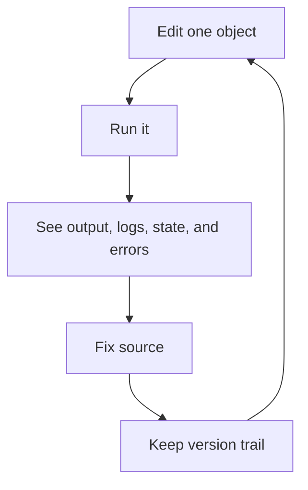

# DBBASIC Object Server

DBBASIC Object Server runs live, versioned Python application objects on a
single VM. It ships with a working suite of apps — projects, notes, tasks,
contacts, articles, links, a calendar, files, and a shell you can talk to —
each one a package of a schema, permission rules, and at most one page
object, with no app-specific server code. Changes to objects, schemas, and
permissions are live on the next request; there is no build or deploy step.

It is stdlib-only Python plus uvicorn, data in human-readable files you can
grep and back up, one permission engine enforced across every surface
(web, API, search, files, MCP agents, and AI), and MIT licensed. A $5–$7
VM is plenty.

**Get it running:** [`docs/quickstart.md`](docs/quickstart.md) takes a fresh
VM to a running server, a login, an HTTPS domain, and a first app in about
thirty minutes with [`scripts/install.sh`](scripts/install.sh). New to the
idea? Start with [why it is different](docs/why-dbbasic.md).

**It runs its own homepage:** [dbbasic.com](https://dbbasic.com) is served in
production by this server — one host on a multi-domain instance, its pages
stored as records and rendered by a pair of page objects. Editing the site is
a data change, not a deploy.

This public codebase was assembled from a working prototype in small,
reviewed, tested slices — each checked for private deployment details before
release. That discipline continues as new capability lands.

## The Core Idea

A DBBASIC object is one small Python file that can do useful application work.

An object can be an API endpoint, page, report, worker, webhook, admin action,
scheduled job, or business record handler. It can also keep state, write logs,
store files, and keep old source versions.

The point is to keep the things needed for development close together:

- source
- state
- logs
- files
- versions
- runtime errors
- execution output

That gives DBBASIC a short loop:



This is the `100x dev loop` this project is trying to protect. The whole
app suite is built on it — see [`docs/app-packages.md`](docs/app-packages.md)
for the apps and [`docs/shell-and-ai.md`](docs/shell-and-ai.md) for the
shell that lets you (or an AI) operate the server by talking to it.

The loop is meant to happen inside the running object server, not through a full
CI, build, and deployment cycle, so small object changes can be tested and
repaired much faster than normal application releases.

## Why It Is Different

DBBASIC is not trying to copy Rails, Django, or a normal MVC framework.

Those patterns can still be built with objects when they are useful, but they
are not required. The server starts with the object itself.

The old CGI model had a simple idea: a request could map directly to code. The
problem was speed, because classic CGI started a new process for every request.

DBBASIC keeps the direct mental model but uses ASGI so the server stays running.
Then it adds the missing parts: source, state, logs, files, versions, runtime
errors, and rollback all belong near the object.

That makes the system useful for humans and AI tools:

- change one object without redeploying the whole app
- execute it immediately
- inspect what happened
- patch the source
- keep or roll back the version

## What Objects Can Do

- handle HTTP requests
- run from queues, schedules, events, or tools
- state and logs are stored in simple file-backed formats
- companion tools such as DBBASIC Scroll can inspect and operate the runtime
- connect to SQL, SQLite, HTTP APIs, or AI APIs when an object or package needs
  them, without making that the default app stack

## Current Public Contents

This repository currently contains:

- `object_server.py` - minimal ASGI server slice
- `python_object_runtime.py` - minimal direct Python object loader for early execution tests
- `object_namespace.py` - object source discovery and object ID resolution
- `object_execution.py` - structured object execution results and error capture
- `object_correlation.py` - UUIDv4 request/action correlation IDs for logs,
  source versions, audits, and error responses
- `object_ids.py` - UUIDv4 helpers for server-created resource IDs
- `object_collections.py` - read-only collection summaries derived from objects, records, and permission policy
- `object_records.py` - TSV-backed collection records for generated tables and forms
- `object_source.py` - source read, update, version, and rollback operations
- `object_source_changes.py` - append-only source edit/rollback changelog helpers
- `object_state.py` - TSV-backed object state reads and runtime writes
- `object_files.py` - object-owned file listing, download, and gated write helpers
- `object_file_changes.py` - append-only file upload/update/delete changelog helpers
- `object_identity.py` - file-backed accounts, users, and sessions for permission subjects
- `object_credentials.py` - scrypt password hashes stored separately from user records
- `object_identity_cli.py` - Django-style shell management for accounts, users, and passwords
- `object_logs.py` - TSV-backed object log reads, appends, rotation, compression, retention, and runtime logger helper
- `object_metadata.py` - conservative object metadata summaries
- `object_schemas.py` - schema metadata for generated UI, validation rules, field permissions, and relations
- `object_schema_versions.py` - schema version history and rollback helpers
- `object_events.py` - daemon-compatible event publishing and subscription state helpers
  for record mutations, triggers, listeners, and webhooks
- `object_packages.py` - package manifest discovery, dry-runs, and conservative install writes
- `object_package_changes.py` - append-only package dry-run/install/rollback changelog helpers
- `object_field_permissions.py` - schema-level `edit/read/hidden` enforcement for collection record fields
- `object_permission_audit.py` - JSONL-backed permission decision audit reads and writes
- `object_permission_store.py` - JSON-backed permission policy persistence
- `object_permissions.py` - server-side access modes, role/object/action checks,
  ownership, sharing, subscriptions, temporary grants, and row/field filters
- `object_permission_status.py` - enforcement readiness gates, coverage reporting, and rollout warnings
- `object_rate_limit.py` - file-backed request rate limiting
- `object_record_changes.py` - append-only collection record changelog helpers
- `object_versions.py` - source version metadata, content snapshots, and rollback
- `object_backup.py` - runtime backup, restore-point, verification, and safe restore helpers
- `object_daemon.py` - background worker for scheduler, queue, events, and cleanup
- `object_daemon_control.py` - scheduler task and queue message write helpers for operator screens
- `object_daemon_status.py` - read-only daemon, scheduler, queue, and delivery posture
- `http_api_contract.py` - compatibility constants for paths and response shapes
- `deployment_checks.py` - single-VM filesystem ownership and permission checks
- `packages/hello-world/` - minimal example package with one object
- `packages/system-dashboard/` - small installable dashboard object for public
  staging
- `packages/admin-write-probe/` - narrow staging package for proving object
  state writes and admin-gated collection record writes

It does not yet contain the full private prototype, cluster runtime, full Scroll
admin dashboard, sample applications, production installer, public signup flow,
or production isolation for untrusted user code.

## Object Source Directories

New DBBASIC object source should live under `objects/`.

Set `DBBASIC_OBJECTS_DIR` to point at a custom object source directory during migration or deployment.

Installable DBBASIC packages should live under `packages/{package_id}/`. The
current repository includes `hello-world`, `system-dashboard`, and
`admin-write-probe` as small package fixtures that can be installed on a
controlled VM.
Each package currently uses `dbbasic-package.json` plus package-owned `objects/`,
`schemas/`, `permissions/`, `seed/`, and `migrations/` paths. The public server
can list packages, return dry-run install plans, and run conservative installs
when `DBBASIC_ENABLE_PACKAGE_INSTALLS=true` and `DBBASIC_ADMIN_TOKEN` are both
set. Installs currently create/replace objects and schemas, create seed TSV
files only when data does not already exist, and reject permission/migration
writes until those merge/run semantics are explicit. The HTTP install route
creates a restore point before live files are changed. A separate package
restore endpoint can restore one of those recorded runtime snapshots when
`DBBASIC_ENABLE_PACKAGE_RESTORE=true`; it prunes package-created runtime files
that were not present in the snapshot. Dry-runs, installs, and restores append
compact package changelog entries under
`data/package_changes/{package_id}/changes.jsonl` so Scroll can show what was
reviewed, installed, restored, or rejected.
Object file writes append compact file changelog entries under
`data/file_changes/{object_id}/changes.jsonl` so uploads, overwrites, and
deletes can be shown in the same admin activity stream as source, record, and
package changes.

The package direction is how AskRobots-style primitives move into DBBASIC:
messages, projects, tasks, notes, files, articles, links, contacts, finance,
events, workers, templates, catalog, time tracking, AI usage, objects, forums,
documentation, and APIs should become reviewable packages instead of one
hardcoded app surface.

## Minimal Server

The current public ASGI server can list objects, return source for an existing
object, execute object `GET`, `POST`, `PUT`, and `DELETE` methods, and update
source when the explicit source-write gate is enabled. It can also list source
versions, read a specific version, read object state, read object logs, read
object-owned files, read object metadata, list derived collections, read and
write collection records, read and write schema metadata, manage file-backed
accounts/users/sessions, inspect packages, run package dry-runs, install gated
packages with restore points, report admin runtime status, and roll back source
through the same write gate.
Object execution can return JSON data, HTML/text/binary responses through
`content_type` and `body`, or a low-level `(status, headers, body)` tuple.

This server is useful for local development and controlled staging. It is not
the final auth boundary yet. Object listing and introspection reads require the
temporary admin token unless `DBBASIC_ENABLE_SESSION_ADMIN_GATES=true` allows
active DBBASIC sessions with an admin role to pass the same gate. Source updates
and rollback require that admin gate plus the explicit source-write gate.
Route-level permission enforcement exists, but it is disabled unless the
deployment explicitly enables it. If you put it behind a public hostname, expose
only explicit public object routes through a reverse proxy and keep source
writes disabled.

```bash
python -m pip install -e '.[server,test]'
uvicorn object_server:app --host 127.0.0.1 --port 8001
```

Current endpoints:

- `GET /health`
- `GET /health?capacity=true`
- `GET /health?metrics=true`
- `GET /admin/status`
- `GET /admin/changes`
- `GET /admin/ops`
- `GET /admin/objects`
- `POST /admin/objects`
- `GET /admin/objects/{object_id}`
- `GET /admin/objects/{object_id}?metadata=true`
- `GET /admin/objects/{object_id}?source=true&format=json`
- `PUT /admin/objects/{object_id}?source=true`
- `POST /admin/objects/{object_id}/execute`
- `GET /admin/objects/{object_id}?state=true`
- `GET /admin/objects/{object_id}?logs=true&limit=100`
- `GET /admin/objects/{object_id}?source_changes=true&limit=100`
- `GET /admin/objects/{object_id}?changes=true&limit=100`
- `GET /admin/objects/{object_id}?versions=true&limit=10`
- `GET /admin/objects/{object_id}?version=1`
- `GET /admin/objects/{object_id}?files=true`
- `GET /admin/objects/{object_id}?file=name`
- `GET /admin/files`
- `GET /admin/files?object_id=site_home`
- `GET /admin/files/{object_id}`
- `GET /admin/files/{object_id}?file=name`
- `POST /admin/files/{object_id}`
- `PUT /admin/files/{object_id}`
- `DELETE /admin/files/{object_id}?file=name`
- `GET /admin/collections`
- `GET /admin/collections/{collection}`
- `GET /admin/collections/{collection}/records`
- `GET /admin/collections/{collection}/records/{record_id}`
- `GET /admin/collections/{collection}/changes`
- `GET /admin/collections/{collection}/records/{record_id}/changes`
- `POST /admin/collections/{collection}/records`
- `PUT /admin/collections/{collection}/records/{record_id}`
- `DELETE /admin/collections/{collection}/records/{record_id}`
- `GET /admin/schemas`
- `GET /admin/schemas/{collection}`
- `GET /admin/schemas/{collection}?versions=true&limit=10`
- `GET /admin/schemas/{collection}?version=1`
- `PUT /admin/schemas/{collection}`
- `POST /admin/schemas/{collection}`
- `GET /admin/identity/accounts`
- `GET /admin/identity/accounts/{account_id}`
- `GET /admin/identity/users`
- `GET /admin/identity/users/{user_id}`
- `POST /admin/identity/users/{user_id}/password`
- `DELETE /admin/identity/users/{user_id}/password`
- `GET /admin/identity/sessions`
- `GET /admin/identity/sessions/{session_id}`
- `GET /daemon/status`
- `GET /daemon/scheduler/tasks`
- `POST /daemon/scheduler/tasks`
- `PATCH /daemon/scheduler/tasks/{task_id}`
- `DELETE /daemon/scheduler/tasks/{task_id}`
- `GET /daemon/queue/messages`
- `POST /daemon/queue/messages`
- `PATCH /daemon/queue/messages/{message_id}`
- `DELETE /daemon/queue/messages/{message_id}`
- `GET /permissions/policy`
- `PUT /permissions/policy`
- `GET /permissions/status`
- `POST /permissions/check`
- `GET /permissions/audit`
- `GET /identity`
- `GET /identity/accounts`
- `POST /identity/accounts`
- `GET /identity/accounts/{account_id}`
- `GET /identity/users`
- `POST /identity/users`
- `GET /identity/users/{user_id}`
- `POST /identity/users/{user_id}/password`
- `DELETE /identity/users/{user_id}/password`
- `GET /identity/sessions`
- `POST /identity/sessions`
- `GET /identity/sessions/{session_id}`
- `DELETE /identity/sessions/{session_id}`
- `GET /identity/session`
- `POST /identity/session`
- `DELETE /identity/session`
- `GET /login`
- `POST /login`
- `POST /logout`
- `POST /api/mcp`
- `GET /api/search`
- `WebSocket /ws` (realtime record-change push)
- `POST /api/ai/chat`
- `POST /api/files`
- `GET /api/files/{file_id}`
- `DELETE /api/files/{file_id}`
- `GET /identity/users/{user_id}/service-keys`
- `PUT /identity/users/{user_id}/service-keys`
- `DELETE /identity/users/{user_id}/service-keys/{service}`
- `GET /collections`
- `GET /collections/{collection}`
- `GET /collections/{collection}/records`
- `POST /collections/{collection}/records`
- `GET /collections/{collection}/records/{record_id}`
- `PUT /collections/{collection}/records/{record_id}`
- `DELETE /collections/{collection}/records/{record_id}`
- `GET /collections/{collection}/changes`
- `GET /collections/{collection}/records/{record_id}/changes`
- `GET /schemas`
- `GET /schemas/{collection}`
- `GET /schemas/{collection}?versions=true&limit=10`
- `GET /schemas/{collection}?version=1`
- `PUT /schemas/{collection}`
- `POST /schemas/{collection}` with `{"action": "rollback", "version_id": 1}`
- `GET /events`
- `POST /events`
- `DELETE /events`
- `GET /events/deliveries`
- `GET /events/subscriptions`
- `POST /events/subscriptions`
- `DELETE /events/subscriptions`
- `GET /packages`
- `GET /packages/{package_id}`
- `GET /packages/{package_id}?dry_run=true`
- `POST /packages/{package_id}/install`
- `POST /packages/{package_id}/restore`
- `GET /packages/{package_id}/changes`
- `GET /objects?format=json`
- `POST /objects`
- `GET /objects/{object_id}`
- `POST /objects/{object_id}`
- `PUT /objects/{object_id}`
- `DELETE /objects/{object_id}`
- `GET /objects/{object_id}?state=true`
- `GET /objects/{object_id}?logs=true&limit=100`
- `GET /objects/{object_id}?files=true`
- `GET /objects/{object_id}?file=name`
- `GET /objects/{object_id}?metadata=true`
- `GET /objects/{object_id}?source=true&format=json`
- `GET /objects/{object_id}?source_changes=true&limit=100`
- `GET /objects/{object_id}?changes=true&limit=100`
- `GET /objects/{object_id}?versions=true&limit=10`
- `GET /objects/{object_id}?version=1`
- `PUT /objects/{object_id}?source=true`
- `POST /objects/{object_id}` with `{"action": "rollback", "version_id": 1}`

Execution currently uses `python_object_runtime.py`, a direct Python loader. It
is useful for proving the loop, but it is not the production sandbox or security
boundary.

Event subscriptions expose delivery status for Scroll and daemon operators:
`idle`, `ok`, or `failed`, with attempt counts, last status code, and last error.
The daemon advances `last_event_id` only after a successful callback.

Permission policy/check/audit endpoints, object listing, source, state, logs,
metadata, and versions require:

```bash
export DBBASIC_ADMIN_TOKEN=replace-with-a-local-dev-token
export DBBASIC_DATA_DIR=./data
export DBBASIC_BACKUPS_DIR=./data/backups
export DBBASIC_PACKAGES_DIR=./packages
export DBBASIC_ENABLE_PACKAGE_INSTALLS=false
export DBBASIC_ENABLE_PACKAGE_RESTORE=false
export DBBASIC_MAX_REQUEST_BYTES=1048576
export DBBASIC_MAX_CONCURRENT_REQUESTS=64
export DBBASIC_MAX_CONCURRENT_EXECUTIONS=8
export DBBASIC_OBJECT_TIMEOUT_SECONDS=5
export DBBASIC_TRUSTED_IN_PROCESS_OBJECTS=site_home
export DBBASIC_RATE_LIMIT_REQUESTS=1000
export DBBASIC_RATE_LIMIT_WINDOW_SECONDS=60
export DBBASIC_ENABLE_PERMISSION_AUDIT=false
export DBBASIC_ENABLE_PERMISSION_ENFORCEMENT=false
export DBBASIC_ALLOW_UNREADY_PERMISSION_ENFORCEMENT=false
export DBBASIC_PERMISSION_TRUST_HEADERS=false
export DBBASIC_ENABLE_SESSION_LOGIN=false
export DBBASIC_SESSION_LOGIN_TOKEN=
export DBBASIC_ENABLE_RECORD_EVENTS=true
export DBBASIC_EVENT_KEEP_COUNT=1000
export DBBASIC_EVENT_KEEP_SECONDS=604800
```

The value above is a placeholder. Each real deployment must generate its own
secret outside the source tree. Then send `Authorization: Token <token>` with
the request. Detailed health via `capacity=true` or `metrics=true` also uses
that token because it exposes runtime configuration and process capacity. Source
updates and rollback are disabled by default. `GET /admin/status` uses the same
token and combines detailed health, inventory, capability flags, package
posture, and permission readiness for Scroll/operator dashboards. For local
development only, also set:

```bash
export DBBASIC_ENABLE_SOURCE_WRITES=true
```

Rate limiting is disabled unless `DBBASIC_RATE_LIMIT_REQUESTS` is set above
zero. Public staging and production deployments should set it explicitly.

Permission audit-only mode writes route decisions to
`data/permissions/audit.jsonl` without blocking requests. Enforcement mode uses
the persisted `data/permissions/policy.json` policy to return `401`, `402`, or
`403` before object routes run. Trusted user/account/role headers are disabled
unless `DBBASIC_PERMISSION_TRUST_HEADERS=true` is set behind a proxy that strips
client-supplied copies. Enforcement is readiness-gated: the server requires an
admin recovery token, a valid policy, a non-admin identity path for registered,
subscription, private, or role-based modes, and at least one allow grant for
role-based policy before `DBBASIC_ENABLE_PERMISSION_ENFORCEMENT=true` becomes
effective.

Collection record routes are admin-token gated by default. Reads can use
permission audit or enforcement with the `read` action. Writes require either
the admin token or enforcement mode with an allowed `create`, `update`, or
`delete` decision. Audit-only mode logs write decisions, but it does not grant
mutation access by itself. Enforcement applies row filters before pagination,
checks writes against the affected record, and redacts allowed or denied fields
before returning records. Schema field permissions add the generated-app layer:
fields marked `hidden` are removed from reads, and fields marked `read` or
`hidden` cannot be written by that subject.

If `data/schemas/{collection}.json` exists, collection writes also use it for
server-side validation. Known fields can require values, apply defaults, enforce
basic types, restrict enum values, and reject computed/read-only fields. Unknown
fields still work so DBBASIC can stay schemaless until a collection needs more
structure. This is the migration path for Django/PostgreSQL-style data too:
legacy integer IDs and JSONB-like flexible fields can be imported as collection
data, while new DBBASIC-facing resources should use UUIDv4 IDs for URL/API
identity.

Every HTTP response includes `X-DBBASIC-Correlation-ID`. Clients can send a
UUIDv4 value in that header, or the server will create one. Source versions,
source-change entries, object logs, permission audit entries, and execution error
responses carry the same ID when available, so Scroll and AI tools can connect
one action to the exact code, data, logs, and errors it produced.

Admin schema writes also keep a changelog under
`data/schema_versions/{collection}/`. Scroll can list previous versions, inspect
the JSON that was written, and roll back by creating a new version from an older
one.

File-backed users and sessions exist. Session-token clients can inspect and
revoke their own session without the admin token. A guarded
`POST /identity/session` route can mint a session for an existing active user
when `DBBASIC_ENABLE_SESSION_LOGIN=true` and the caller presents
`DBBASIC_SESSION_LOGIN_TOKEN`; it refuses caller-supplied role, account, and
subscription overrides so the session subject comes from the registry.
Admin-token gates remain admin-token-only by default. A deployment can set
`DBBASIC_ENABLE_SESSION_ADMIN_GATES=true` to also accept active sessions whose
subject has one of the policy admin roles, which gives Scroll a path away from
storing the raw deployment token.
Scroll and operator dashboards should use the GET-only `/admin/identity/*`
aliases to inspect accounts, users, and sessions on public staging — plus the
password write aliases — without exposing identity creation, arbitrary session
minting, or session revocation.
External auth gateway integration and default-on permission enforcement still
need to be finished before general public use.

## First Auth Setup

A fresh deployment has no users and all login paths disabled. To bootstrap
browser login on a new VM:

1. Create the first admin user and set its password from the shell on the VM
   (like Django's `createsuperuser`; the password is prompted, never echoed,
   and only the scrypt hash is stored under `data/identity/credentials.tsv`):

   ```bash
   cd /opt/dbbasic-object-server
   sudo -u dbbasic DBBASIC_DATA_DIR=/var/lib/dbbasic-object-server/data \
     .venv/bin/python object_identity_cli.py create-superuser \
     --user-id dan --email dan@example.com
   ```

2. Enable password login in the environment file (for systemd deployments,
   `/etc/dbbasic-object-server.env`) and restart the service:

   ```bash
   DBBASIC_ENABLE_PASSWORD_LOGIN=true
   ```

3. Allow `/login` and `/logout` through the reverse proxy. Users can then sign
   in at `https://your-host/login`; the session is stored in an `HttpOnly`
   `dbbasic_session` cookie and objects receive the caller in
   `request["_identity"]`.

Day-to-day user management works three ways, all against the same TSV-backed
identity store:

- **Shell**: `object_identity_cli.py` (`create-account`, `create-user`,
  `create-superuser`, `set-password`, `remove-password`, `list-users`,
  `list-accounts`)
- **Scroll / HTTP admin surface**: `POST /identity/users`,
  `POST /admin/identity/users/{user_id}/password`, and the read-only
  `/admin/identity/*` inspection aliases
- **Objects**: object code reads `request["_identity"]` for per-user behavior

Secrets stay out of source control: password hashes and session token hashes
live under the runtime `data/` directory (git-ignored), and deployment tokens
live in the environment file on the VM.

## Current Extraction Slice

The current public slice is not the whole server yet. It defines the first shared
rules the rest of the server will use:

- `object_server.py` exposes the first ASGI endpoints
- `python_object_runtime.py` loads simple Python objects for early execution tests
- `object_namespace.py` maps object IDs to files under `objects/`
- `object_execution.py` returns success or error results from object method runs
- `object_correlation.py` keeps request/action correlation IDs as UUIDv4 values
- `object_source.py` reads, updates, versions, and rolls back source files
- `object_source_changes.py` records source edits and rollbacks as append-only
  JSONL under `data/source_changes/`
- `object_state.py` reads and writes runtime-owned TSV-backed object state
- `object_records.py` reads and writes TSV-backed collection records under `data/collections/`
- `object_record_changes.py` keeps append-only collection record change history
- `object_events.py` publishes events and subscriptions into `data/state/events/state.tsv`
  and collection record mutations emit metadata-only `collection.record.*` events; event
  retention keeps the delivery queue bounded while change history stays durable
- `object_daemon_status.py` reads scheduler, queue, event, subscription, and
  cleanup posture for Scroll without running daemon work
- `object_packages.py` reads `packages/{package_id}/dbbasic-package.json` and builds
  dry-run/install plans for Scroll/package manager workflows
- `object_package_changes.py` records package dry-runs, installs, failures, and future rollbacks
  facts as append-only JSONL under `data/package_changes/`
- `object_file_changes.py` records object-owned file creates, updates, and deletes
  as append-only JSONL under `data/file_changes/`
- `packages/admin-write-probe` installs a tiny `dbbasic_probe` schema/record
  file plus a public status object, so a staging server can prove object state
  writes and admin-token-gated collection CRUD without exposing broad routes
- `object_files.py` lists, reads, and gated-writes object-owned files under `data/files/`
- `object_logs.py` reads and appends TSV-backed object logs, rotates/compresses old logs, and provides `_logger`
- `object_metadata.py` summarizes source, state, logs, files, and versions
- `object_permission_audit.py` records and reads route permission decisions
- `object_schema_versions.py` keeps schema changelogs and rollback history
- `object_versions.py` keeps source history as `metadata.tsv` plus `vN.txt` files
- `object_backup.py` archives and safely restores object source plus runtime data
- `object_daemon.py` runs scheduled, queued, and event work
- `deployment_checks.py` checks the single-VM filesystem layout before public exposure
- detailed health reports uptime, request metrics, storage status, version,
  config, and request/object execution slot capacity
- admin status combines detailed health, object/collection/schema/package
  inventory, package install posture, capability flags, and permission readiness
  for Scroll and staging dashboards
- daemon status reports scheduler tasks, queue messages, event delivery state,
  retention settings, and rate-limit cleanup posture without adding a separate
  Flower-style service
- guarded session login can mint existing-user sessions with a dedicated
  gateway token, without exposing the admin-only arbitrary session endpoint
- request bodies over `DBBASIC_MAX_REQUEST_BYTES` return `413 Payload Too Large`
- traffic over `DBBASIC_RATE_LIMIT_REQUESTS` per `DBBASIC_RATE_LIMIT_WINDOW_SECONDS`
  returns `429 Too Many Requests`
- full request and object execution slots return `503 Service Unavailable`
- object execution over `DBBASIC_OBJECT_TIMEOUT_SECONDS` returns `504 Gateway Timeout`
- trusted server-owned objects listed in `DBBASIC_TRUSTED_IN_PROCESS_OBJECTS`
  run in-process even when object timeouts are enabled; do not use this for
  unreviewed user code
- optional permission audit logs route decisions without changing responses
- optional permission enforcement checks object routes before source,
  introspection, or execution work runs, and stays in shadow mode until recovery,
  identity, and policy readiness checks pass
- `basics_counter` maps to `objects/basics/counter.py`
- `u_42_deals` maps to `objects/users/42/deals.py`
- rollbacks create a new version instead of deleting history
- URL/API-facing resource IDs should be UUIDv4 for new DBBASIC data; imported
  legacy rows can keep compatibility IDs during migration
- source updates through HTTP require `DBBASIC_ENABLE_SOURCE_WRITES=true` and an
  admin token
- object file writes through HTTP require `DBBASIC_ENABLE_FILE_WRITES=true`, an
  admin token, and pass `DBBASIC_MAX_OBJECT_FILE_BYTES`
- object listing and introspection reads require an admin token
- HTTP version history makes the loop visible: update source, inspect versions,
  rollback, and run the object again
- the old prototype source directory name is intentionally not a public default

These pieces come first so the ASGI server, daemon, Scroll, tests, and migration
tools all agree on the same object rules.

See `docs/README.md` for the documentation map,
`docs/why-dbbasic.md` for the advantages and boundaries,
`docs/app-packages.md` for the application suite,
`docs/shell-and-ai.md` for the shell and AI operation,
`docs/status.md` for the current readiness checklist,
`docs/runtime-contract.md` for the daemon-facing runtime contract,
`docs/http-api-contract.md` for the HTTP API shape that existing clients expect,
`docs/object-authoring.md` for the current object authoring shape and
object-first storage/schema loop,
`docs/backup-restore.md` for runtime backup and restore,
`docs/traffic-limits.md` for request-size and high-traffic operating limits,
`docs/asgi-realtime-direction.md` for the ASGI/realtime direction, and
`docs/rest-and-object-messages.md` for the resource/message split. See
`docs/single-vm-deployment.md` for the first conservative staging deployment
shape, and `docs/docker-deployment.md` for the container-based alternative.

Read `SECURITY.md` and `CONTRIBUTING.md` before copying code or documentation from private prototypes into this repository.

## Deployment

The first deployment path is the bare-VM installer in
[`docs/single-vm-deployment.md`](docs/single-vm-deployment.md): one small VM,
systemd, and a local reverse proxy.

A second path packages the same server as a container image, with
`Dockerfile` and `docker-compose.yml` at the repository root, for running
under plain Docker Compose or deploying with [Coolify](https://coolify.io/).
Runtime state (object source, records, logs, versions, identity) lives on
persistent volumes outside the image, so image rebuilds stay separate from
live object edits made through the admin HTTP API. See
[`docs/docker-deployment.md`](docs/docker-deployment.md) for the quickstart,
the Coolify-specific steps, and the first-boot admin token story.

This is not hypothetical: [dbbasic.com](https://dbbasic.com), the project's
own homepage, runs in production on a single instance of this server. The
whole site is a `dbbasic_pages` collection (one record per page, pre-rendered
HTML), two page objects that wrap records in the site chrome, a `site_hosts`
record mapping the domain to its page namespace, and a reverse-proxy block
serving static assets and download binaries from disk. It shares that
instance with other hosts — the multi-domain routing described in
[`docs/site-routing.md`](docs/site-routing.md) — and updating a page is a
record write with an audit trail, not a redeploy.

## Status

Public staging runtime.

The object server has moved past the first extraction slice. It now has enough
public code to build controlled object-backed apps on one VM: ASGI serving,
object execution, source/state/log/file/version storage, rollback, TSV-backed
collections, schemas, validation, change logs, events, package dry-runs and
gated installs, backups, identity records, permission policy/audit/enforcement
hooks, traffic limits, health metrics, GitHub Actions, and deployment checks.

It is suitable for local development, dogfooding, controlled staging, and
careful internal apps where the operator controls the code and users. It is not
yet safe as an open public runtime where strangers can sign up and run arbitrary
code.

Near-term work:

- connect guarded existing-user session minting to a real browser login or
  trusted auth gateway
- make permission enforcement default-on after the login/auth gateway is wired
- add CPU and memory isolation for untrusted object code
- finish event delivery controls after the scheduler/queue control surface is
  stable
- add file upload/delete with quotas, content limits, permissions, and audit
- wire Scroll to the public identity, permission, package, event, backup, and
  dashboard APIs
- add a repeatable single-VM installer after the manual path stays boring

## Public Repository Safety

This repository is being extracted from a working private prototype in small, reviewed commits.

Before code or docs are copied here, they should be checked for private deployment details, secrets, credentials, local paths, real hostnames, and real IP addresses.

Public sample configuration should use only safe placeholder values:

- `127.0.0.1` for localhost samples
- `192.0.2.0/24`, `198.51.100.0/24`, or `203.0.113.0/24` for documentation IPs
- `example.com`, `example.net`, or `example.org` for documentation domains
- `.env.example` for configuration shape, never real `.env` values

Do not commit real LAN IPs, cloud IPs, customer hostnames, API tokens, private URLs, personal filesystem paths, or deployment-specific station names.

## DBBASIC Scroll

DBBASIC Scroll is the companion app for connecting to an object server, browsing objects, executing them, inspecting source/state/logs/versions/files, and managing the system.

Scroll will remain optional: the object server should be usable through HTTP and command-line tools without requiring the GUI.

## License

MIT License. See `LICENSE`.
