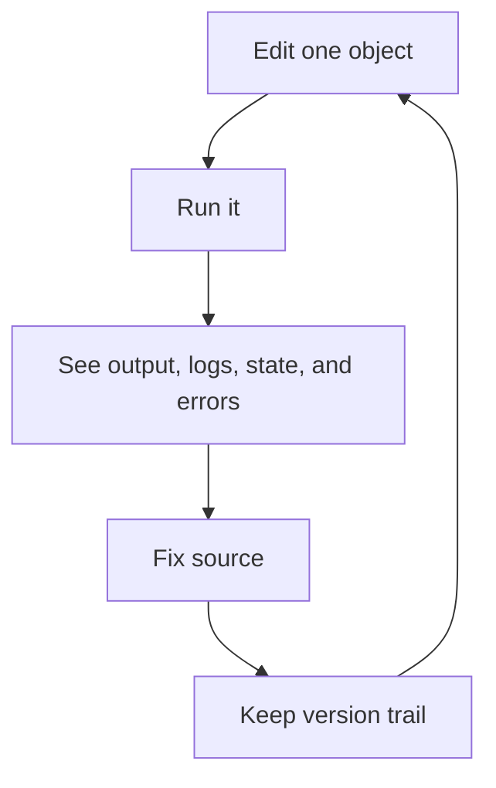

# DBBASIC Object Server

DBBASIC Object Server runs live, versioned Python application objects.

This repository is being assembled from an existing working prototype. The public codebase is intentionally moving in small reviewed slices so each piece can be tested, documented, and checked for private deployment details before release.

The rest of the server will move here as it is cleaned up for release.

## The Core Idea

A DBBASIC object is one small Python file that can do useful application work.

An object can be an API endpoint, page, report, worker, webhook, admin action,
scheduled job, or business record handler. It can also keep state, write logs,
store files, and keep old source versions.

The point is to keep the things needed for development close together:

- source
- state
- logs
- files
- versions
- runtime errors
- execution output

That gives DBBASIC a short loop:



This is the `100x dev loop` this project is trying to protect.

The loop is meant to happen inside the running object server, not through a full
CI, build, and deployment cycle, so small object changes can be tested and
repaired much faster than normal application releases.

## Why It Is Different

DBBASIC is not trying to copy Rails, Django, or a normal MVC framework.

Those patterns can still be built with objects when they are useful, but they
are not required. The server starts with the object itself.

The old CGI model had a simple idea: a request could map directly to code. The
problem was speed, because classic CGI started a new process for every request.

DBBASIC keeps the direct mental model but uses ASGI so the server stays running.
Then it adds the missing parts: source, state, logs, files, versions, runtime
errors, and rollback all belong near the object.

That makes the system useful for humans and AI tools:

- change one object without redeploying the whole app
- execute it immediately
- inspect what happened
- patch the source
- keep or roll back the version

## What Objects Can Do

- handle HTTP requests
- run from queues, schedules, events, or tools
- state and logs are stored in simple file-backed formats
- companion tools such as DBBASIC Scroll can inspect and operate the runtime
- connect to SQL, SQLite, HTTP APIs, or AI APIs when an object or package needs
  them, without making that the default app stack

## Current Public Contents

This repository currently contains:

- `object_server.py` - minimal ASGI server slice
- `python_object_runtime.py` - minimal direct Python object loader for early execution tests
- `object_namespace.py` - object source discovery and object ID resolution
- `object_execution.py` - structured object execution results and error capture
- `object_collections.py` - read-only collection summaries derived from objects and permission policy
- `object_source.py` - source read, update, version, and rollback operations
- `object_state.py` - TSV-backed object state reads and runtime writes
- `object_files.py` - read-only object-owned file listing and download helpers
- `object_logs.py` - TSV-backed object log reads, appends, rotation, compression, retention, and runtime logger helper
- `object_metadata.py` - conservative object metadata summaries
- `object_schemas.py` - read-only schema metadata for generated UI, validation hints, and relations
- `object_permission_audit.py` - JSONL-backed permission decision audit reads and writes
- `object_permission_store.py` - JSON-backed permission policy persistence
- `object_permissions.py` - server-side access modes, role/object/action checks,
  ownership, sharing, subscriptions, temporary grants, and row/field filters
- `object_versions.py` - source version metadata, content snapshots, and rollback
- `object_backup.py` - runtime backup, verification, and safe restore helpers
- `object_daemon.py` - background worker for scheduler, queue, events, and cleanup
- `deployment_checks.py` - single-VM filesystem ownership and permission checks

It does not yet contain the full private prototype, cluster runtime, dashboard,
sample applications, package system, or production installer.

## Object Source Directories

New DBBASIC object source should live under `objects/`.

Set `DBBASIC_OBJECTS_DIR` to point at a custom object source directory during migration or deployment.

## Minimal Server

The current public ASGI server can list objects, return source for an existing
object, execute object `GET`, `POST`, `PUT`, and `DELETE` methods, and update
source when the explicit source-write gate is enabled. It can also list source
versions, read a specific version, read object state, read object logs, read
object-owned files, read object metadata, list derived collections, read schema
metadata, and roll back source through the same write gate. Object execution can
return JSON data, HTML/text/binary responses through `content_type` and `body`,
or a low-level `(status, headers, body)` tuple.

This server is useful for local development and controlled staging. It is not
the final auth boundary yet. Object listing and introspection reads require the
temporary admin token. Source updates and rollback require the same token plus
the explicit source-write gate. Route-level permission enforcement exists, but
it is disabled unless the deployment explicitly enables it. If you put it behind
a public hostname, expose only explicit public object routes through a reverse
proxy and keep source writes disabled.

```bash
python -m pip install -e '.[server,test]'
uvicorn object_server:app --host 127.0.0.1 --port 8001
```

Current endpoints:

- `GET /health`
- `GET /health?capacity=true`
- `GET /health?metrics=true`
- `GET /permissions/policy`
- `PUT /permissions/policy`
- `POST /permissions/check`
- `GET /permissions/audit`
- `GET /collections`
- `GET /collections/{collection}`
- `GET /schemas`
- `GET /schemas/{collection}`
- `GET /objects?format=json`
- `GET /objects/{object_id}`
- `POST /objects/{object_id}`
- `PUT /objects/{object_id}`
- `DELETE /objects/{object_id}`
- `GET /objects/{object_id}?state=true`
- `GET /objects/{object_id}?logs=true&limit=100`
- `GET /objects/{object_id}?metadata=true`
- `GET /objects/{object_id}?source=true&format=json`
- `GET /objects/{object_id}?versions=true&limit=10`
- `GET /objects/{object_id}?version=1`
- `PUT /objects/{object_id}?source=true`
- `POST /objects/{object_id}` with `{"action": "rollback", "version_id": 1}`

Execution currently uses `python_object_runtime.py`, a direct Python loader. It
is useful for proving the loop, but it is not the production sandbox or security
boundary.

Permission policy/check/audit endpoints, object listing, source, state, logs,
metadata, and versions require:

```bash
export DBBASIC_ADMIN_TOKEN=replace-with-a-local-dev-token
export DBBASIC_DATA_DIR=./data
export DBBASIC_MAX_REQUEST_BYTES=1048576
export DBBASIC_MAX_CONCURRENT_REQUESTS=64
export DBBASIC_MAX_CONCURRENT_EXECUTIONS=8
export DBBASIC_OBJECT_TIMEOUT_SECONDS=5
export DBBASIC_TRUSTED_IN_PROCESS_OBJECTS=site_home
export DBBASIC_RATE_LIMIT_REQUESTS=1000
export DBBASIC_RATE_LIMIT_WINDOW_SECONDS=60
export DBBASIC_ENABLE_PERMISSION_AUDIT=false
export DBBASIC_ENABLE_PERMISSION_ENFORCEMENT=false
export DBBASIC_PERMISSION_TRUST_HEADERS=false
```

The value above is a placeholder. Each real deployment must generate its own
secret outside the source tree. Then send `Authorization: Token <token>` with
the request. Detailed health via `capacity=true` or `metrics=true` also uses
that token because it exposes runtime configuration and process capacity. Source
updates and rollback are disabled by default. For local development only, also
set:

```bash
export DBBASIC_ENABLE_SOURCE_WRITES=true
```

Rate limiting is disabled unless `DBBASIC_RATE_LIMIT_REQUESTS` is set above
zero. Public staging and production deployments should set it explicitly.

Permission audit-only mode writes route decisions to
`data/permissions/audit.jsonl` without blocking requests. Enforcement mode uses
the persisted `data/permissions/policy.json` policy to return `401`, `402`, or
`403` before object routes run. Trusted user/account/role headers are disabled
unless `DBBASIC_PERMISSION_TRUST_HEADERS=true` is set behind a proxy that strips
client-supplied copies.

Production user/session auth still needs to replace the temporary admin-token
gate before general use.

## Current Extraction Slice

The current public slice is not the whole server yet. It defines the first shared
rules the rest of the server will use:

- `object_server.py` exposes the first ASGI endpoints
- `python_object_runtime.py` loads simple Python objects for early execution tests
- `object_namespace.py` maps object IDs to files under `objects/`
- `object_execution.py` returns success or error results from object method runs
- `object_source.py` reads, updates, versions, and rolls back source files
- `object_state.py` reads and writes runtime-owned TSV-backed object state
- `object_files.py` lists and reads object-owned files under `data/files/`
- `object_logs.py` reads and appends TSV-backed object logs, rotates/compresses old logs, and provides `_logger`
- `object_metadata.py` summarizes source, state, logs, files, and versions
- `object_permission_audit.py` records and reads route permission decisions
- `object_versions.py` keeps source history as `metadata.tsv` plus `vN.txt` files
- `object_backup.py` archives and safely restores object source plus runtime data
- `object_daemon.py` runs scheduled, queued, and event work
- `deployment_checks.py` checks the single-VM filesystem layout before public exposure
- detailed health reports uptime, request metrics, storage status, version,
  config, and request/object execution slot capacity
- request bodies over `DBBASIC_MAX_REQUEST_BYTES` return `413 Payload Too Large`
- traffic over `DBBASIC_RATE_LIMIT_REQUESTS` per `DBBASIC_RATE_LIMIT_WINDOW_SECONDS`
  returns `429 Too Many Requests`
- full request and object execution slots return `503 Service Unavailable`
- object execution over `DBBASIC_OBJECT_TIMEOUT_SECONDS` returns `504 Gateway Timeout`
- trusted server-owned objects listed in `DBBASIC_TRUSTED_IN_PROCESS_OBJECTS`
  run in-process even when object timeouts are enabled; do not use this for
  unreviewed user code
- optional permission audit logs route decisions without changing responses
- optional permission enforcement checks object routes before source,
  introspection, or execution work runs
- `basics_counter` maps to `objects/basics/counter.py`
- `u_42_deals` maps to `objects/users/42/deals.py`
- rollbacks create a new version instead of deleting history
- source updates through HTTP require `DBBASIC_ENABLE_SOURCE_WRITES=true` and an
  admin token
- object listing and introspection reads require an admin token
- HTTP version history makes the loop visible: update source, inspect versions,
  rollback, and run the object again
- the old prototype source directory name is intentionally not a public default

These pieces come first so the ASGI server, daemon, Scroll, tests, and migration
tools all agree on the same object rules.

See `docs/README.md` for the documentation map,
`docs/runtime-contract.md` for the daemon-facing runtime contract,
`docs/http-api-contract.md` for the HTTP API shape that existing clients expect,
`docs/object-authoring.md` for the current object authoring shape and
object-first storage/schema loop,
`docs/backup-restore.md` for runtime backup and restore,
`docs/traffic-limits.md` for request-size and high-traffic operating limits,
`docs/asgi-realtime-direction.md` for the ASGI/realtime direction, and
`docs/rest-and-object-messages.md` for the resource/message split. See
`docs/single-vm-deployment.md` for the first conservative staging deployment
shape.

Read `SECURITY.md` and `CONTRIBUTING.md` before copying code or documentation from private prototypes into this repository.

## Status

Early public assembly.

The object server has been useful internally, but this repository is
intentionally starting small so the public codebase can be reviewed and cleaned
as it grows.

The public repository now has a runnable ASGI server, direct Python object
execution, source/state/log/version storage, metadata, a daemon slice, the first
permissions evaluator, tests, GitHub Actions, and a conservative single-VM
staging path. It is ready for local experimentation and controlled staging, not
general public code execution.

Near-term work:

- move the hardened core runtime and sandbox into this repository
- connect real sessions, accounts, and auth gateways to permission enforcement
- add Scroll-compatible permission audit and introspection endpoints
- add CPU, memory, wall-clock, and rate limits around execution
- wire scheduled backup retention and Scroll backup controls to `object_backup.py`
- keep the HTTP contract compatible with Scroll and existing tools
- add deployment scripts after the manual single-VM path stays boring

## Public Repository Safety

This repository is being extracted from a working private prototype in small, reviewed commits.

Before code or docs are copied here, they should be checked for private deployment details, secrets, credentials, local paths, real hostnames, and real IP addresses.

Public sample configuration should use only safe placeholder values:

- `127.0.0.1` for localhost samples
- `192.0.2.0/24`, `198.51.100.0/24`, or `203.0.113.0/24` for documentation IPs
- `example.com`, `example.net`, or `example.org` for documentation domains
- `.env.example` for configuration shape, never real `.env` values

Do not commit real LAN IPs, cloud IPs, customer hostnames, API tokens, private URLs, personal filesystem paths, or deployment-specific station names.

## DBBASIC Scroll

DBBASIC Scroll is the companion app for connecting to an object server, browsing objects, executing them, inspecting source/state/logs/versions/files, and managing the system.

Scroll will remain optional: the object server should be usable through HTTP and command-line tools without requiring the GUI.

## License

MIT License. See `LICENSE`.
