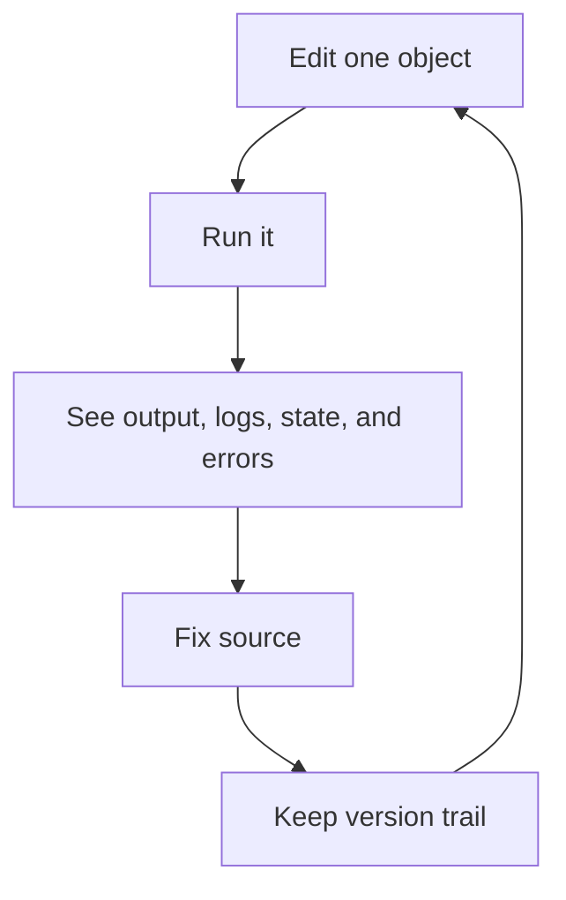

# DBBASIC Object Server

DBBASIC Object Server runs live, versioned Python application objects.

This repository is being assembled from an existing working prototype. The public codebase is intentionally moving in small reviewed slices so each piece can be tested, documented, and checked for private deployment details before release.

The rest of the server will move here as it is cleaned up for release.

## The Core Idea

A DBBASIC object is one small Python file that can do useful application work.

An object can be an API endpoint, page, report, worker, webhook, admin action,
scheduled job, or business record handler. It can also keep state, write logs,
store files, and keep old source versions.

The point is to keep the things needed for development close together:

- source
- state
- logs
- files
- versions
- runtime errors
- execution output

That gives DBBASIC a short loop:



This is the `100x dev loop` this project is trying to protect.

The loop is meant to happen inside the running object server, not through a full
CI, build, and deployment cycle, so small object changes can be tested and
repaired much faster than normal application releases.

## Why It Is Different

DBBASIC is not trying to copy Rails, Django, or a normal MVC framework.

Those patterns can still be built with objects when they are useful, but they
are not required. The server starts with the object itself.

The old CGI model had a simple idea: a request could map directly to code. The
problem was speed, because classic CGI started a new process for every request.

DBBASIC keeps the direct mental model but uses ASGI so the server stays running.
Then it adds the missing parts: source, state, logs, files, versions, runtime
errors, and rollback all belong near the object.

That makes the system useful for humans and AI tools:

- change one object without redeploying the whole app
- execute it immediately
- inspect what happened
- patch the source
- keep or roll back the version

## What Objects Can Do

- handle HTTP requests
- run from queues, schedules, events, or tools
- state and logs are stored in simple file-backed formats
- companion tools such as DBBASIC Scroll can inspect and operate the runtime

## Current Public Contents

This repository currently contains:

- `object_server.py` - minimal read-only ASGI server slice
- `python_object_runtime.py` - minimal direct Python object loader for early execution tests
- `object_namespace.py` - object source discovery and object ID resolution
- `object_execution.py` - structured object execution results and error capture
- `object_source.py` - source read, update, version, and rollback operations
- `object_versions.py` - source version metadata, content snapshots, and rollback
- `object_daemon.py` - background worker for scheduler, queue, events, and cleanup

It does not yet contain the full object server, API handlers, object runtime, sample applications, package system, or production deployment files.

## Object Source Directories

New DBBASIC object source should live under `objects/`.

Set `DBBASIC_OBJECTS_DIR` to point at a custom object source directory during migration or deployment.

## Minimal Server

The current public ASGI server can list objects, return source for an existing
object, execute an object's `GET(request)` function, and update source when the
explicit source-write gate is enabled.

```bash
python -m pip install -e '.[server,test]'
uvicorn object_server:app --host 127.0.0.1 --port 8001
```

Current endpoints:

- `GET /health`
- `GET /objects?format=json`
- `GET /objects/{object_id}`
- `GET /objects/{object_id}?source=true&format=json`
- `PUT /objects/{object_id}?source=true`

Execution currently uses `python_object_runtime.py`, a direct Python loader. It
is useful for proving the loop, but it is not the production sandbox or security
boundary.

Source updates are disabled by default. For local development only:

```bash
export DBBASIC_ENABLE_SOURCE_WRITES=true
export DBBASIC_ADMIN_TOKEN=replace-with-a-local-dev-token
export DBBASIC_DATA_DIR=./data
```

Then send `Authorization: Token <token>` with the update request. Production
auth and permissions still need to replace this temporary gate before general
use.

## Current Extraction Slice

The current public slice is not the whole server yet. It defines the first shared
rules the rest of the server will use:

- `object_server.py` exposes the first ASGI endpoints
- `python_object_runtime.py` loads simple Python objects for early execution tests
- `object_namespace.py` maps object IDs to files under `objects/`
- `object_execution.py` returns success or error results from object runs
- `object_source.py` reads, updates, versions, and rolls back source files
- `object_versions.py` keeps source history as `metadata.tsv` plus `vN.txt` files
- `object_daemon.py` runs scheduled, queued, and event work
- `basics_counter` maps to `objects/basics/counter.py`
- `u_42_deals` maps to `objects/users/42/deals.py`
- rollbacks create a new version instead of deleting history
- source updates through HTTP require `DBBASIC_ENABLE_SOURCE_WRITES=true` and an
  admin token
- the old prototype source directory name is intentionally not a public default

These pieces come first so the ASGI server, daemon, Scroll, tests, and migration
tools all agree on the same object rules.

See `docs/README.md` for the documentation map,
`docs/runtime-contract.md` for the daemon-facing runtime contract,
`docs/http-api-contract.md` for the HTTP API shape that existing clients expect,
`docs/asgi-realtime-direction.md` for the ASGI/realtime direction, and
`docs/rest-and-object-messages.md` for the resource/message split.

Read `SECURITY.md` and `CONTRIBUTING.md` before copying code or documentation from private prototypes into this repository.

## Status

Early public assembly.

The object server has been useful internally, but this repository is intentionally starting small so the public codebase can be reviewed and cleaned as it grows.

Near-term work:

- move the core object runtime into this repository
- add a minimal runnable server
- document object conventions
- add tests
- define permissions and execution boundaries
- document production deployment

## Public Repository Safety

This repository is being extracted from a working private prototype in small, reviewed commits.

Before code or docs are copied here, they should be checked for private deployment details, secrets, credentials, local paths, real hostnames, and real IP addresses.

Public sample configuration should use only safe placeholder values:

- `127.0.0.1` for localhost samples
- `192.0.2.0/24`, `198.51.100.0/24`, or `203.0.113.0/24` for documentation IPs
- `example.com`, `example.net`, or `example.org` for documentation domains
- `.env.example` for configuration shape, never real `.env` values

Do not commit real LAN IPs, cloud IPs, customer hostnames, API tokens, private URLs, personal filesystem paths, or deployment-specific station names.

## DBBASIC Scroll

DBBASIC Scroll is the companion app for connecting to an object server, browsing objects, executing them, inspecting source/state/logs/versions/files, and managing the system.

Scroll will remain optional: the object server should be usable through HTTP and command-line tools without requiring the GUI.

## License

MIT License. See `LICENSE`.
