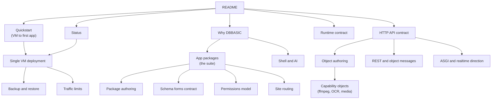

# Documentation

DBBASIC docs should be easy to enter from the root README and then branch into
focused pages.

The root README should explain the project in minutes. The docs directory should
hold the deeper contracts, design rules, and implementation notes.

## Current Docs

- `quickstart.md` - the linear path from a fresh VM to a running
  server, a login, a domain with HTTPS, and a first app installed —
  about thirty minutes, using `scripts/install.sh`.
- `why-dbbasic.md` - the advantages, honestly stated with their
  boundaries: live change, apps-as-data, one permission engine,
  speed-through-less, AI-native without lock-in.
- `comparisons.md` - what DBBASIC deletes relative to Django/Rails,
  enterprise stacks, JS meta-frameworks, SaaS suites, and no-code
  platforms — with the cost of each deletion stated, and receipts.
- `app-packages.md` - the installed application suite (projects, notes,
  tasks, contacts, articles, links, events, files, shell,
  collaboration) and the schema+rules+page pattern every app repeats.
- `shell-and-ai.md` - the talk-to-everything terminal: per-user AI
  provider keys, model choice, MCP tool subsets, conversation resume,
  and building live objects by asking ("coding without coding").
- `design-system.md` - the semantic-contract design system: token roles,
  themes as data and as packages (base/paper/terminal), the stylesheet
  served as the `site_style` object at `/style`, and why semantics beat a
  widget-prescriptive ui_schema.
- `capability-objects.md` - objects that shell out to system tools
  (ffmpeg, tesseract/OCR, ImageMagick, PDF text): the subprocess
  execution model, worked examples, the trust boundary, and how they
  compose with files, records, and AI.
- `runtime-contract.md` - runtime, daemon, namespace, version, queue, scheduler,
  and event contracts.
- `http-api-contract.md` - existing `/objects` HTTP API shape used by current
  clients and tools.
- `status.md` - current readiness checklist, useful deployment shape, known
  non-goals, and next production-hardening work.
- `object-authoring.md` - current object source layout, method shape, runtime
  helpers, state/log usage, response return forms, and the object-first
  storage/schema loop.
- `asgi-realtime-direction.md` - why the server uses plain ASGI, and how
  WebSocket/SSE object events fit the direction.
- `rest-and-object-messages.md` - how DBBASIC separates RESTful resources from
  object behavior messages and realtime streams.
- `single-vm-deployment.md` - conservative staging deployment on one VM with
  systemd, localhost uvicorn, separate object/data paths, filesystem checks,
  provider monitoring, and backup notes.
- `backup-restore.md` - runtime archive format, verification, safe restore, and
  what stays out of portable backups.
- `traffic-limits.md` - request-size limits, high-traffic safety layers, and
  the next rate/concurrency/execution boundaries.
- `permissions-model.md` - server-side access modes, role/object/action rules,
  ownership, sharing, row/field filters, subscriptions, temporary paid access,
  route enforcement, and audit readback.
- `package-authoring.md` - the practical guide for building an installable
  package: manifest, layout, install semantics, dry-run workflow, and rules
  for generated packages.
- `schema-forms.md` - the schema field contract that generates forms and
  views: types, enums, relations, validation bounds, form layout, and list
  modes, all enforced on record writes.
- `site-routing.md` - clean public URLs for websites: convention routing,
  the `site_routes` records table with `{param}`/`{param:uuid}` patterns,
  `site_404`, and why routing maps URLs while the permission policy decides
  access.
- `runtime-contract.md#packages` and `http-api-contract.md#packages` - package
  manifest layout, package discovery, dry-runs, and package change history.

## Documentation Rules

- Keep the README short enough to explain the project quickly.
- Move detailed design contracts into focused docs.
- Link related docs instead of duplicating long explanations.
- Use Mermaid diagrams when they make the system easier to understand.
- Keep examples safe: no real IPs, private paths, tokens, or deployment names.
- Prefer runnable examples when the public code supports them.

## Future Docs

Useful next docs:

- object method reference
- realtime event contract (with the websocket slice)

PHP-style community notes were useful because examples and corrections lived
near the function being used. GitHub does not provide inline manual comments in
the same way, but DBBASIC can get close by linking docs, examples, tests, issues,
and discussions around each public object/runtime surface.
