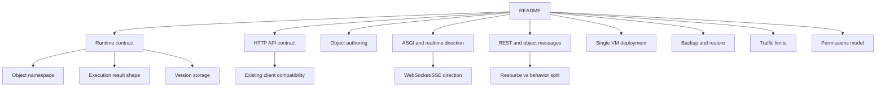

# Documentation

DBBASIC docs should be easy to enter from the root README and then branch into
focused pages.

The root README should explain the project in minutes. The docs directory should
hold the deeper contracts, design rules, and implementation notes.

## Current Docs

- `runtime-contract.md` - runtime, daemon, namespace, version, queue, scheduler,
  and event contracts.
- `http-api-contract.md` - existing `/objects` HTTP API shape used by current
  clients and tools.
- `object-authoring.md` - current object source layout, method shape, runtime
  helpers, state/log usage, response return forms, and the object-first
  storage/schema loop.
- `asgi-realtime-direction.md` - why the server uses plain ASGI, and how
  WebSocket/SSE object events fit the direction.
- `rest-and-object-messages.md` - how DBBASIC separates RESTful resources from
  object behavior messages and realtime streams.
- `single-vm-deployment.md` - conservative staging deployment on one VM with
  systemd, localhost uvicorn, separate object/data paths, filesystem checks,
  provider monitoring, and backup notes.
- `backup-restore.md` - runtime archive format, verification, safe restore, and
  what stays out of portable backups.
- `traffic-limits.md` - request-size limits, high-traffic safety layers, and
  the next rate/concurrency/execution boundaries.
- `permissions-model.md` - server-side access modes, role/object/action rules,
  ownership, sharing, row/field filters, subscriptions, temporary paid access,
  route enforcement, and audit readback.

## Documentation Rules

- Keep the README short enough to explain the project quickly.
- Move detailed design contracts into focused docs.
- Link related docs instead of duplicating long explanations.
- Use Mermaid diagrams when they make the system easier to understand.
- Keep examples safe: no real IPs, private paths, tokens, or deployment names.
- Prefer runnable examples when the public code supports them.

## Future Docs

Useful next docs:

- object method reference
- AI repair loop guide
- realtime event contract
- package/install guide

PHP-style community notes were useful because examples and corrections lived
near the function being used. GitHub does not provide inline manual comments in
the same way, but DBBASIC can get close by linking docs, examples, tests, issues,
and discussions around each public object/runtime surface.
