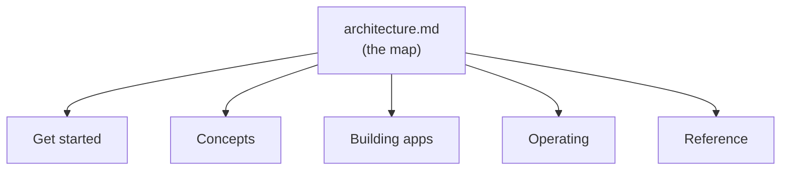

# Documentation

Start with **[architecture.md](architecture.md)** — it maps the whole system
and links every doc in place. The rest of this page is the same index, grouped
by theme, with every doc one click away.

## Start here

- [architecture.md](architecture.md) — the layer map: storage → runtime → data
  → permissions → generative UI → capabilities → surfaces, with a link to the
  doc for each.
- [why-dbbasic.md](why-dbbasic.md) — the advantages, honestly stated with their
  boundaries.
- [quickstart.md](quickstart.md) — a fresh VM to a running server, login, HTTPS
  domain, and a first app in ~30 minutes with `scripts/install.sh`.
- [comparisons.md](comparisons.md) — what DBBASIC deletes vs Django/Rails,
  enterprise stacks, JS meta-frameworks, and no-code — and the cost of each.

## Concepts

- [runtime-contract.md](runtime-contract.md) — runtime, daemon, namespace,
  version, queue, scheduler, and event contracts.
- [object-authoring.md](object-authoring.md) — object source layout, method
  shape, runtime helpers, state/log usage, and response forms.
- [capability-objects.md](capability-objects.md) — objects that shell out to
  system tools (ffmpeg, OCR, PDF), the subprocess model, and the trust boundary.
- [realtime.md](realtime.md) — the change-log contract: the `/ws` subscribe
  protocol, the signal-only (never-the-body) event, and per-subscriber
  permission filtering that makes every surface live.
- [asgi-realtime-direction.md](asgi-realtime-direction.md) — why plain ASGI, and
  how WebSocket/SSE object events fit.
- [rest-and-object-messages.md](rest-and-object-messages.md) — RESTful resources
  vs object behavior messages vs realtime streams.

## Data, UI, and behavior

- [schema-forms.md](schema-forms.md) — the schema field contract that generates
  forms and views: types, enums, relations, validation bounds, list modes — all
  enforced on write.
- [generative-ui.md](generative-ui.md) — the one renderer: list/table/board/
  tree/calendar, filters, search, relation labels, forms, and composed detail —
  no per-app UI code.
- [capabilities.md](capabilities.md) — per-collection behaviors from a schema
  flag: comments, attachments, owner-checked sharing, and how to add one.
- [validation-and-logic.md](validation-and-logic.md) — what's validated on every
  write, and the business-logic/automation substrate (transitions, notify,
  triggers, computed, connectors).
- [business-logic-patterns.md](business-logic-patterns.md) — where every rule
  goes: the placement flowchart and map, with worked examples (sales tax,
  payment aging, dunning, refunds) most systems get wrong.
- [logic-decisions.md](logic-decisions.md) — the living log of logic-placement
  doctrines (stamp vs derive, time belongs to the daemon, money moves,
  extract-after-repeat, gates vs reactions).
- [design-system.md](design-system.md) — semantic tokens, themes as data and as
  packages, and the stylesheet served as the `site_style` object at `/style`.
- [ui-decisions.md](ui-decisions.md) — the living log of interaction decisions
  (detail-vs-edit, the row cap, filters, relation labels, capabilities).

## Building & shipping apps

- [app-packages.md](app-packages.md) — the installed app suite and the
  schema+rules+page pattern every app repeats.
- [package-authoring.md](package-authoring.md) — manifest, layout, install
  semantics, dry-run workflow, and rules for generated packages.
- [upgrade-and-customization.md](upgrade-and-customization.md) — the
  data-preserving upgrade system: baselines, three-way reconcile, overrides,
  feature flags.
- [permissions-model.md](permissions-model.md) — access modes, role/object/
  action rules, ownership, row/field filters, sharing, temporary paid access,
  and audit.
- [site-routing.md](site-routing.md) — clean public URLs, the `site_routes`
  table, `{param}` patterns, `site_404`.
- [secrets-and-credentials.md](secrets-and-credentials.md) — the write-only
  vault, hash-only tokens, and the trust boundary.
- [shell-and-ai.md](shell-and-ai.md) — the talk-to-everything terminal: per-user
  AI keys, model choice, MCP tool subsets, and building objects by asking.

## Storage & durability

- [storage-modes.md](storage-modes.md) — classic vs append-only collections.
- [append-only-storage-design.md](append-only-storage-design.md) — tombstones,
  compaction, and the disposable id→offset sidecar.
- [durability-and-recovery.md](durability-and-recovery.md) — write durability
  and recovery-by-replay.
- [backup-restore.md](backup-restore.md) — archive format, verification, and
  safe read-only restore preview.

## Operating

- [single-vm-deployment.md](single-vm-deployment.md) — conservative one-VM
  staging with systemd, localhost uvicorn, separate object/data paths.
- [docker-deployment.md](docker-deployment.md) — the Docker/Coolify path.
- [traffic-limits.md](traffic-limits.md) — request-size limits and the
  rate/concurrency/execution boundaries.
- [status.md](status.md) — readiness checklist, useful deployment shape, and
  next production-hardening work.

## Reference

- [http-api-contract.md](http-api-contract.md) — the full HTTP API shape used by
  clients and tools.

## Documentation Rules

- Keep the root README short enough to explain the project quickly; link into
  focused docs from there and from [architecture.md](architecture.md).
- **Link docs as a real markdown link, not a `` `code span` ``** — a code span
  renders as monospace text and is not clickable on GitHub.
- Use Mermaid diagrams when they make the system easier to understand.
- Keep examples safe: no real IPs, private paths, tokens, or deployment names.
- Prefer runnable examples when the public code supports them.
