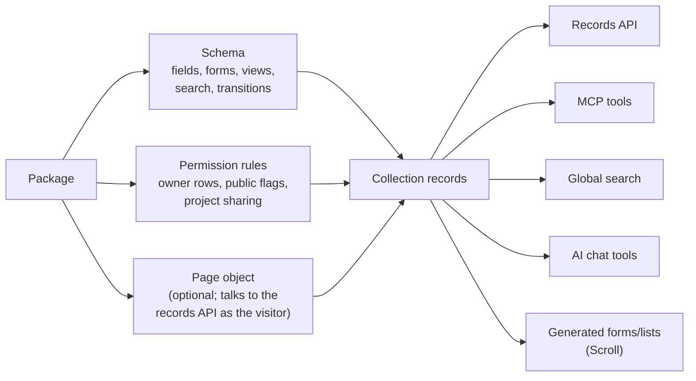

# The App Suite — Applications as Installable Packages

DBBASIC ships a suite of everyday applications. None of them required
server code: each app is a package of **schema + permission rules +
(optionally) one page object**. The server provides the primitives —
records, permissions, search, sharing, files, AI — and apps are data
that composes them.

Because every surface reads the same schema and passes the same
permission engine, installing an app instantly gives it: a validated
records API, generated forms and lists in Scroll, global search, MCP
tools for agents, and AI chat access — with row-level visibility rules
applied identically everywhere.

## The Suite

| Package | Collections | Page | Notable |
|---|---|---|---|
| `app-projects` | projects, project_access | `/projects` | The hub other apps relate to; self-serve sharing grants |
| `app-notes` | notes | `/notes`, `/notes/{id}` | Public/private per note; permalinks; quick capture |
| `app-tasks` | tasks | `/tasks` | Status lifecycle enforced by a `transitions` map; assignee access |
| `app-contacts` | contacts, organizations, interactions, tags | `/contacts` | CRM; interactions use the `feed` list mode |
| `app-articles` | articles | `/articles`, `/articles/{id}` | Publish flips one boolean; anonymous-readable blog |
| `app-links` | links | `/links` | Bookmarks with tags |
| `app-events` | events | `/calendar` | Calendar; purpose enum; project sharing |
| `app-files` | files | `/files` | Uploads with quotas; downloads governed by the metadata record |
| `app-templates` | templates | — | Reusable bodies; public sharing |
| `app-timers` | time_logs | — | Time tracking against tasks |
| `app-shell` | shell_preferences, shell_commands | `/shell` | The talk-to-everything terminal (see the shell guide) |
| `app-collab` | task_comments, feed_posts, notifications | — | Comments, the human+agent coordination feed, notification records |

Packages without a page are managed entirely through generated UIs,
the shell, and MCP — proof that the schema contract carries a whole
app's interface.

## The Pattern

Every app repeats the same shape. To build a new one, copy `app-notes`
and follow [package authoring](package-authoring.md):

1. **Schema** — fields with semantics (`docs/schema-forms.md`):
   types, enums, relations, validation, `search.fields`,
   `views.list_mode`, and `transitions` for lifecycle fields.
2. **Rules** — the standard grants, composed per record:
   - owner rows: `{"row_filter": {"owner_id": "$user_id"}}`
   - public rows: `{"principal": "public", "row_filter": {"is_public": "true"}}`
   - project sharing: `{"row_filter": {"project_id": "$accessible_projects"}}`
   - a public `execute` grant for the page object, which renders a
     sign-in prompt to anonymous visitors
3. **Page object** — one Python file returning HTML; its JavaScript
   talks to `/collections/{name}/records` and `/api/search` with the
   visitor's session cookie, so the page holds no data access of its
   own.

Visibility rules compose per record: a note can be readable because
you own it, because it is public, or because it sits in a project
shared with you — three rules, no visibility code in the app.

## Relations Between Apps

Apps point at each other with validated `relation` fields, not an
association framework: tasks and notes relate to projects, interactions
to contacts, time logs to tasks, comments to tasks. A relation is a
pointer plus a display hint; writes validate that the target record
exists, and nothing joins, cascades, or lazy-loads.
