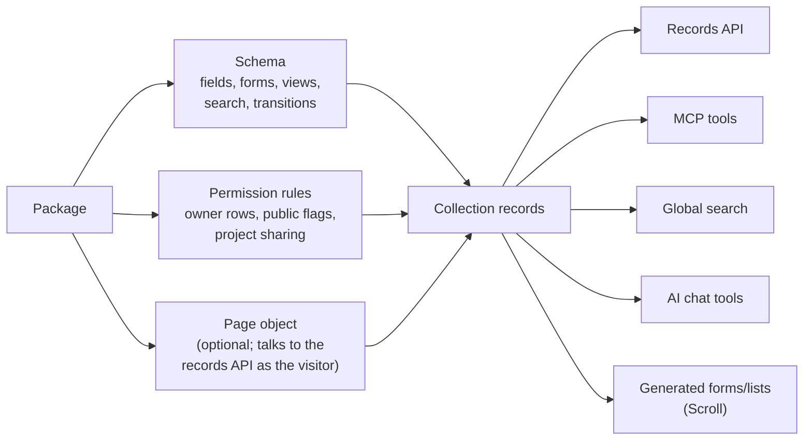

# The App Suite — Applications as Installable Packages

DBBASIC ships a suite of everyday applications. None of them required
server code: each app is a package of **schema + permission rules +
(optionally) one page object**. The server provides the primitives —
records, permissions, search, sharing, files, AI — and apps are data
that composes them.

```mermaid
flowchart LR
    P["Package"] --> S["Schema<br/>fields, forms, views,<br/>search, transitions"]
    P --> R["Permission rules<br/>owner rows, public flags,<br/>project sharing"]
    P --> O["Page object<br/>(optional; talks to the<br/>records API as the visitor)"]
    S --> C["Collection records"]
    R --> C
    O --> C
    C --> API["Records API"]
    C --> MCP["MCP tools"]
    C --> SRCH["Global search"]
    C --> AI["AI chat tools"]
    C --> UI["Generated forms/lists<br/>(Scroll)"]
```

Because every surface reads the same schema and passes the same
permission engine, installing an app instantly gives it: a validated
records API, generated forms and lists in Scroll, global search, MCP
tools for agents, AI chat access, and a live web page — with row-level
visibility rules applied identically everywhere.

Each app's page is also **realtime**: it subscribes to its collection
over the shared `/ws` websocket and re-renders when a record it can see
changes, so a note added in one tab (or by an agent) appears in another
with no reload — one line per page, permission-filtered like everything
else. See [design-system](design-system.md) and the
[realtime contract](http-api-contract.md#realtime-push-websocket).

## The Suite

Fifty-two packages. They are grouped here by what they are FOR rather than
alphabetically, because the grouping is the argument: the money apps share
one ledger and one composer, the commerce apps share one catalogue and one
stock log, and nothing in either column needed server code to exist.

### The original slice — records, sharing, capture

| Package | Collections | Page | Notable |
|---|---|---|---|
| `app-projects` | projects, project_access | `/projects` | The hub other apps relate to; self-serve sharing grants |
| `app-notes` | notes | `/notes` | Public/private per note; permalinks; quick capture |
| `app-tasks` | tasks | `/tasks` | Status lifecycle enforced by a `transitions` map; assignee access |
| `app-contacts` | contacts, organizations, interactions, tags | `/contacts` | CRM; interactions use the `feed` list mode |
| `app-articles` | articles | `/articles` | Publish flips one boolean; anonymous-readable blog |
| `app-links` | links | `/links` | Bookmarks with tags |
| `app-events` | events | `/calendar` | Calendar; purpose enum; project sharing |
| `app-files` | files | `/files` | Uploads with quotas; downloads governed by the metadata record |
| `app-templates` | templates | `/templates` | Reusable bodies; the thing `app-runner` executes |
| `app-timers` | time_logs, rate_cards | `/time-logs` | Time tracking against tasks, and what an hour costs |
| `app-forum` | forum_categories, forum_topics, forum_replies | `/forum` | Threaded discussion on the same permission engine |
| `app-worker` | profiles, follows, profile_comments | `/profile/edit` | Public profiles and a follow graph |

### Money — one ledger, one composer, one set of books

| Package | Collections | Page | Notable |
|---|---|---|---|
| `app-finance` | denominations, rates, fin_accounts, fin_journals, fin_journal_lines, fin_recurring, fin_closed_periods, expenses | `/accounts`, `/journals`, `/trial-balance`, `/statements`, `/expenses` | Double-entry: every other money app composes journals through one idempotent composer, provenance-stamped |
| `app-invoices` | invoices, invoice_lines | `/invoices` | Line discounts and tax through the shared `object_lines` arithmetic |
| `app-payments` | payments, refunds | `/payments` | Cash/accrual basis is configuration; bounces reverse rather than delete |
| `app-billing` | wallets, wallet_entries, billing_plans, subscriptions, usage_events, usage_summaries | `/customer-funds` | Prepaid balances as a LIABILITY: a top-up is not revenue until the work is done, and the reconciliation proves it |
| `app-banking` | value_accounts, value_account_counts, bank_import_profiles, bank_statement_imports, bank_lines | `/reconcile` | Statement import and matching — the anti-fraud keystone |
| `app-entities` | entities | `/entities` | Multi-entity: separate books under one login |
| `app-promotions` | promotions, promotion_redemptions | `/promotions` | Basket-level codes, rounded once, with every blocker returned at once |
| `app-disputes` | disputes | `/disputes` | Chargebacks and what was said about them |
| `app-integrity` | anchors | `/ledger-integrity` | A daily digest per money ledger, so a break can be bracketed to a day |
| `app-notary` | notarizations | `/notary` | Store a digest, check it later — no custody of the document |

### Commerce — one catalogue, one stock ledger

| Package | Collections | Page | Notable |
|---|---|---|---|
| `app-catalog` | products, locations, stock_moves, backorders, reorder_suggestions | `/products`, `/stock`, `/locations`, `/reorder`, `/backorders` | Stock levels are never stored, only folded from an immutable move log; a variant is a product |
| `app-orders` | orders, order_lines | `/orders` | Line discounts, modifiers and tax through `object_lines` |
| `app-shop` | carts, cart_items | `/shop` | Storefront and checkout: stock, price and slot are all re-checked at commit |
| `app-shipping` | shipments, shipment_lines | `/shipments`, `/pick-list` | Partial fulfilment is ordinary business |
| `app-receiving` | receipts, receipt_lines | — | Goods in, at invoice cost, feeding valuation |
| `app-returns` | return_authorizations | `/returns` | The reverse trip, authorized before it arrives |
| `app-pickup` | pickup_slots | `/pickup` | Collection windows generated before dawn, so the picker is never empty |
| `app-kitchen` | — | `/kitchen` | The make-line view of open orders |

### AI, agents and jobs

| Package | Collections | Page | Notable |
|---|---|---|---|
| `app-runner` | template_runs | `/runs` | The job engine: hold money at submission, execute or submit-and-poll, settle once. A run a provider still holds is never abandoned |
| `app-agents` | agent_registry | `/agents` | Who is operating this server, and whether it and its own scheduled work are still answering |
| `app-shell` | shell_preferences, shell_commands, ai_usage | `/shell`, `/talk` | Talk to everything; drop a file in and the model can read it |
| `app-intake` | scans | `/scans` | A photographed receipt becomes a SUGGESTION, never a posting |
| `app-documents` | sent_documents | `/documents` | One renderer for every business document |

### Platform surfaces — the uniform layers

| Package | Collections | Page | Notable |
|---|---|---|---|
| `app-theme` | — | `/appearance` | The generative renderer: list, detail and form from any schema |
| `app-views` | views | `/flow`, `/urls` | Pages as records — a dashboard is data, not code |
| `app-nav` | nav_entries, attention_sources, attention_counts | `/` | The home page and every app's "needs a human" count |
| `app-settings` | user_prefs, feature_flags, ai_prices, app_settings, unit_prices | — | Server config, per-user prefs, and the price tables |
| `app-share` | record_shares | — | Per-record grants that can only ever narrow |
| `app-notify` | notify_rules | — | Declarative event → notification |
| `app-rollup` | rollup_definitions | — | Derived aggregates, defined as data |
| `app-materialize` | materialize_definitions | — | Scheduled generation of records from a definition |
| `app-thread` | thread_comments | — | The comments capability, for any collection |
| `app-collab` | task_comments, feed_posts, notifications | — | Comments, the human+agent coordination feed, notifications |
| `app-feed` | — | `/feed` | The composed activity stream |
| `app-activity` | — | `/activity` | The change log, rendered |
| `app-dashboard` | — | `/dashboard` | Counts and queues at a glance |
| `app-messaging` | message_threads, messages, message_recipients, message_drafts | `/inbox` | Internal mail on the same permission engine |
| `app-email` | email_outbox | — | Outbound mail as records, sent by a pass |
| `app-analytics` | page_views, conversions | `/analytics`, `/visitors` | Visitors, bots and us, counted apart |
| `app-privacy` | — | `/privacy` | What is collected and why, as a page |

Packages without a page are managed entirely through generated UIs,
the shell, and MCP — proof that the schema contract carries a whole
app's interface.

## The Pattern

Every app repeats the same shape. To build a new one, copy `app-notes`
and follow [package authoring](package-authoring.md):

1. **Schema** — fields with semantics (`docs/schema-forms.md`):
   types, enums, relations, validation, `search.fields`,
   `views.list_mode`, and `transitions` for lifecycle fields.
2. **Rules** — the standard grants, composed per record:
   - owner rows: `{"row_filter": {"owner_id": "$user_id"}}`
   - public rows: `{"principal": "public", "row_filter": {"is_public": "true"}}`
   - project sharing: `{"row_filter": {"project_id": "$accessible_projects"}}`
   - a public `execute` grant for the page object, which renders a
     sign-in prompt to anonymous visitors
3. **Page object** — one Python file returning HTML; its JavaScript
   talks to `/collections/{name}/records` and `/api/search` with the
   visitor's session cookie, so the page holds no data access of its
   own.

Visibility rules compose per record: a note can be readable because
you own it, because it is public, or because it sits in a project
shared with you — three rules, no visibility code in the app.

## Relations Between Apps

Apps point at each other with validated `relation` fields, not an
association framework: tasks and notes relate to projects, interactions
to contacts, time logs to tasks, comments to tasks. A relation is a
pointer plus a display hint; writes validate that the target record
exists, and nothing joins, cascades, or lazy-loads.
