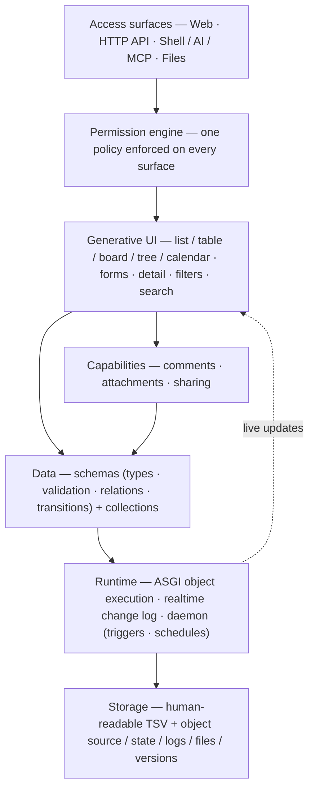

# Architecture — The Layers, and Where Each Doc Fits

DBBASIC is a small stack. Everything is a record or an object in a
human-readable store; each layer above adds capability without hiding the one
below. This page is the map — read it first, then branch into the focused doc
for whichever layer you care about.

Every app is a **package** installed onto this stack — a schema, permission
rules, and at most one page object, with no app-specific server code. The same
stack serves the web page, the API, search, files, and the AI.

## The layers, bottom to top

**Storage.** Collections are plain TSV you can `grep`, in one of two modes
(classic overwrite, or append-only with tombstones + compaction). Each object
keeps its source, state, logs, files, and version trail next to it.
→ [`storage-modes.md`](storage-modes.md),
[`append-only-storage-design.md`](append-only-storage-design.md),
[`durability-and-recovery.md`](durability-and-recovery.md),
[`backup-restore.md`](backup-restore.md)

**Runtime.** A long-running ASGI server executes objects in-process, pooled, or
in a subprocess. A daemon runs scheduled passes, compaction, and
trigger→target automation. A websocket change log lets any surface re-render
live.
→ [`runtime-contract.md`](runtime-contract.md),
[`realtime.md`](realtime.md),
[`asgi-realtime-direction.md`](asgi-realtime-direction.md),
[`object-authoring.md`](object-authoring.md),
[`capability-objects.md`](capability-objects.md)

**Data & schema.** A collection's schema declares its fields — types, enums,
relations (validated pointers), bounds, defaults, and status transitions — and
those are enforced on every write, not just in the form.
→ [`schema-forms.md`](schema-forms.md),
[`validation-and-logic.md`](validation-and-logic.md),
[`business-logic-patterns.md`](business-logic-patterns.md),
[`logic-decisions.md`](logic-decisions.md)

**Permissions.** One engine decides access for every surface: access modes,
role/object/action rules, ownership, row and field filters, temporary paid
access, and record sharing. Routing maps URLs; the policy decides what a
caller may see or write.
→ [`permissions-model.md`](permissions-model.md),
[`site-routing.md`](site-routing.md),
[`secrets-and-credentials.md`](secrets-and-credentials.md)

**Generative UI.** One renderer turns a schema into a live
list/table/board/tree/calendar, a form, and a composed detail page — with
filters, sort, search, relation labels, and realtime updates — no per-app UI
code. The design system is a semantic contract, not prescribed widgets.
→ [`generative-ui.md`](generative-ui.md),
[`design-system.md`](design-system.md),
[`ui-decisions.md`](ui-decisions.md)

**Capabilities.** Generic per-collection *behaviors* on top of the display
layer: a schema flag grows a comment thread, attachment list, or owner-checked
sharing, with no per-app table.
→ [`capabilities.md`](capabilities.md)

**Access surfaces.** The same records reach a web page, the HTTP API,
cross-collection search, file up/download, MCP agents, and a talk-to-everything
shell — all behind the one permission engine.
→ [`http-api-contract.md`](http-api-contract.md),
[`rest-and-object-messages.md`](rest-and-object-messages.md),
[`shell-and-ai.md`](shell-and-ai.md)

**Packages.** Apps are installable packages with a data-preserving upgrade
system (provenance baselines, three-way reconcile, override objects, feature
flags).
→ [`app-packages.md`](app-packages.md),
[`package-authoring.md`](package-authoring.md),
[`upgrade-and-customization.md`](upgrade-and-customization.md)

## Operating it

→ [`quickstart.md`](quickstart.md) (fresh VM to first app),
[`single-vm-deployment.md`](single-vm-deployment.md),
[`docker-deployment.md`](docker-deployment.md),
[`traffic-limits.md`](traffic-limits.md),
[`status.md`](status.md)

## Why it's shaped this way

→ [`why-dbbasic.md`](why-dbbasic.md) (the advantages, honestly stated),
[`comparisons.md`](comparisons.md) (what DBBASIC deletes vs Django/Rails/
no-code, and the cost of each deletion)
