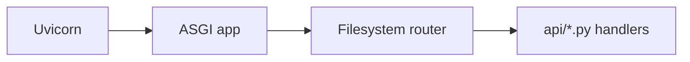
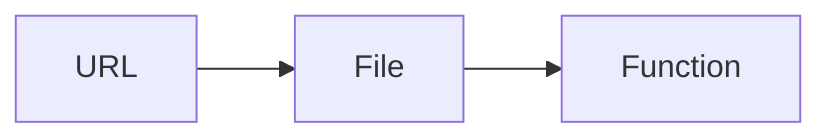
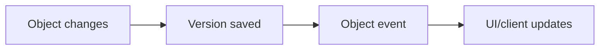
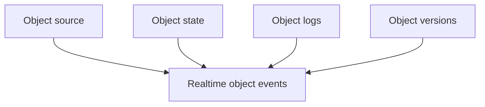

# ASGI And Realtime Direction

The working prototype used plain ASGI with Uvicorn, not Django ASGI, Channels,
FastAPI, or Starlette.

The shape was simple:



That kept the useful part of classic CGI:



but without classic CGI's process-per-request cost.

That is a better comparison than saying DBBASIC is a Rails-like app structure.
The goal is closer to persistent CGI with a reusable object runtime:

- filesystem paths can map to runnable code
- the server stays warm between requests
- routing is derived from object source placement
- common helpers provide state, logs, files, versions, and scheduling
- object boundaries stay small enough for humans and AI tools to inspect

Classic CGI made deployment easy but left too much work to each script. DBBASIC
keeps the direct path-to-code idea and adds the shared runtime pieces that make
objects reusable as application building blocks.

## Why ASGI Matters

ASGI gives DBBASIC one server surface for:

- normal HTTP requests
- long-lived WebSocket connections
- Server-Sent Events
- startup and shutdown lifecycle hooks

That matters because DBBASIC objects are not only pages or REST handlers. They
can also be jobs, event handlers, admin actions, realtime screens, data feeds,
and AI-edited live application pieces.

The important loop is:



HTTP can handle the command. WebSockets or SSE can carry the feedback.

## Phoenix And Erlang

Phoenix and Erlang/BEAM show why realtime application systems can feel so much
better than request/response-only web frameworks:

- long-lived connections are normal
- PubSub is a core idea
- server-side events can update clients quickly
- stateful processes can model active parts of the application
- failures are isolated and supervised

DBBASIC should learn from that direction.

The DBBASIC version is not Erlang and does not get BEAM supervision for free.
Python ASGI does not automatically give per-object process isolation, hot code
replacement, distributed process registries, or Phoenix PubSub semantics.

What DBBASIC can still use well is the product shape:



That can support live admin screens, Scroll object inspectors, AI repair loops,
dashboards, collaborative editing, queues, and business app interfaces without
forcing everything through a Rails/Django-style request/deploy cycle.

## Public V1 Direction

The public v1 server should stay single-node first and keep clustering separate
until replication and conflict behavior are proven.

The first public ASGI layer is now small and runnable. It includes:

- `GET /health`
- `GET /objects?format=json`
- `GET /objects/{object_id}?source=true&format=json`
- object execution
- source update and rollback
- state/log/version endpoints
- metadata endpoints
- temporary admin-token gate for object listing and introspection reads

The next server work is:

- role, object, and row-level permissions
- resource limits around object execution
- backup/restore checks
- WebSocket or SSE object event streams

Realtime should arrive as an object-level event system, not as a decorative
feature. A useful first room model is:

```text
/ws/objects/{object_id}
```

Events should be boring JSON:

```json
{
  "type": "object.source.updated",
  "object_id": "basics_counter",
  "version_id": 2
}
```

That gives Scroll and other clients a way to update immediately when source,
state, logs, versions, or execution status changes.

## Design Rule

Keep the ASGI layer thin.

The server should route requests and streams to object operations. It should not
become a second framework with its own competing object model.
