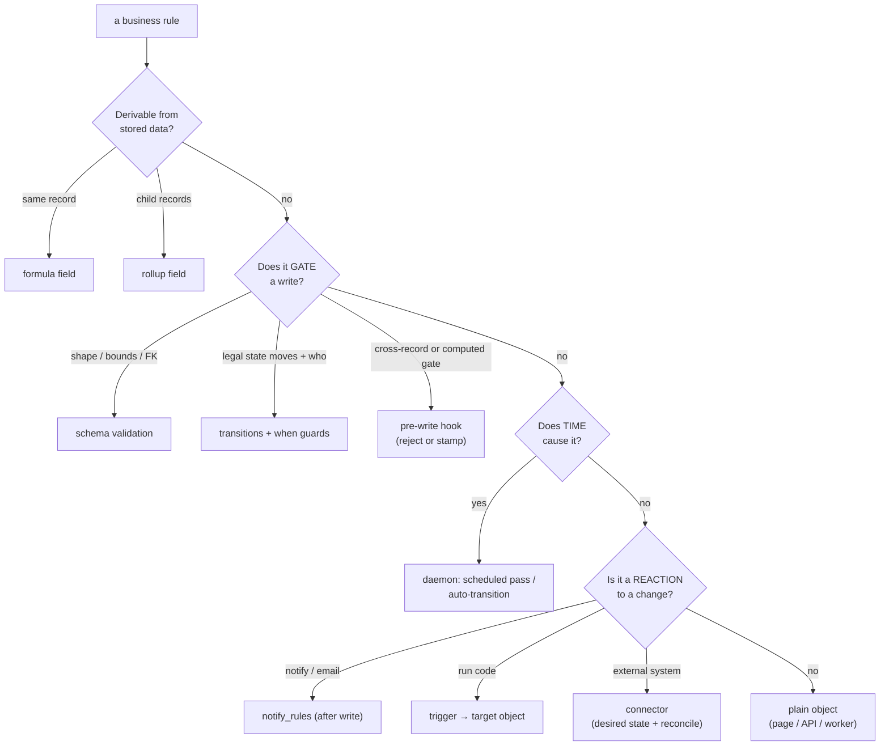

# Business Logic Patterns — Where Every Rule Goes

Every business rule has one correct home in the primitive stack. This page is
the placement guide: the decision procedure, the map, and four worked examples
(sales tax, payment aging, dunning, refunds) that most systems get wrong.
The placement *decisions* and their reasons accumulate in
[`logic-decisions.md`](logic-decisions.md), the way UI behavior accumulates in
[`ui-decisions.md`](ui-decisions.md).

The method behind all of it (see logic-decisions #4): build each module's
rules **concretely** in the cheapest correct primitive — a hook is three lines
of real code — and only promote a pattern to a declarative schema key after it
has repeated in two or three real modules. Concrete → pattern → primitive,
never primitive-first. Systems that build the workflow/rules engine first die
when reality doesn't fit it; ours extracts engines from reality.

## Where does this rule go?

## The placement map

| Kind of rule | Primitive | Lives in | Example |
|---|---|---|---|
| Shape, type, bounds, enum, FK-exists | schema validation | `object_records` write path | amount is integer cents; project must exist |
| Same-record derivation | `formula` (materialized) | `object_computed` via `object_records` | `tax_cents = amount_cents * tax_rate` |
| Aggregation over children | `rollup` (materialized, live) | same | `invoice.paid_cents = sum(payments)` |
| Legal state moves, and who may move | `transitions` + `when` | `object_records` | `draft → posted`, owner only |
| Cross-record gate, computed gate, point-in-time stamp | **pre-write hook** | `hooks.before_write` → `object_server` write path | journal must balance; stamp `tax_rate` |
| Time-driven state | daemon scheduled pass / `after_hours` auto-transition | `object_daemon` | `sent → overdue` when past due |
| Reaction: notify, email | `notify_rules` | daemon, **after** the write | dunning email on `overdue` |
| Reaction: run code | trigger → target object | daemon | recompute, follow-on records |
| External side effect | connector | desired-state records + reconcile | payment-provider refund call |
| Correction to money / inventory | append-only compensating record | `storage: append` collections | refunds, stock moves, journal reversals |
| Everything else | a plain object | anywhere | bespoke report, integration, one-off page |

Two hard boundaries hold the map together:

- **Gates before the write; reactions after.** A hook may reject or stamp but
  never send email or call out — a gate with side effects leaks that a write
  was attempted and couples saves to SMTP. A reaction may notify or spawn work
  but never block the write that already happened.
  ([`event-hooks-decisions.md`](event-hooks-decisions.md))
- **Derived values are non-authoritative; gates are authoritative.** A broken
  formula stores `""` and the write succeeds; a broken hook fails closed and
  the write is rejected. Never let a gate read only a derived value it could
  recompute — the journal-balance hook sums the lines itself even though
  rollup totals exist.

## Worked example 1: sales tax (the one everyone leaves out)

Why it's left out: it hides a doctrine most systems never articulate —
**stamp point-in-time facts; derive live facts** (logic-decisions #1).
The tax *rate* is a fact about the transaction moment: rates change, and the
invoice must forever carry the rate it was issued under.

1. **Rates are data**: a `tax_rates` collection — `region`, `category`,
   `rate`, `valid_from`. Editable like any records; history visible.
2. **Stamping is a hook**: `hooks.before_write` on invoice lines looks up the
   applicable rate and *stamps* `tax_rate` onto the line — same posture as the
   server stamping `owner_id`. The client never supplies it; later rate
   changes never rewrite history.
3. **Amounts are formulas/rollups**: `line.tax_cents = amount_cents *
   tax_rate` (formula); `invoice.tax_total_cents` (rollup). Materialized, so
   they appear on every list/detail/report and update live.

## Worked example 2: payment aging (time makes the state)

The trap: an invoice becomes overdue with **no write happening** — time did
it. Any system that computes "is it late?" ad hoc in the UI grows a dozen
disagreeing copies of that check.

1. `balance_cents` is a **rollup** (`total_cents` minus `sum(payments)`).
2. `sent → overdue` is a **daemon scheduled pass** through the ordinary
   transition machinery, when `due_date < today` and `balance_cents > 0` —
   so the state is *stored*, permission-checked, realtime-pushed, and every
   surface agrees (logic-decisions #2: time-driven state belongs to the
   daemon, never to read-time checks).
3. Aging buckets (30/60/90) are a rollup/report over stored state.

## Worked example 3: dunning (reactions compose on state)

Dunning is nothing new — it is the composition of the two layers above:

1. The daemon flips the state (`overdue`, later `overdue_30`, …).
2. `notify_rules` reacts: state change → email template to the invoice's
   contact. The rule is data; the daemon delivers after the write.
3. Escalation ("again at 30 days unless paid") is *more time-driven state*,
   not a special notification feature — each escalation step is a transition
   the daemon makes, each with its own notify rule.

## Worked example 4: refunds (money moves, never mutates)

**Money never mutates; it moves** (logic-decisions #3). A refund is not an
edit to a payment — it is a new, append-only compensating record, exactly like
a stock move or a journal reversal.

1. `refunds` is an `storage: append` collection pointing at the payment.
2. The invariant is a **hook**: `refund ≤ payment − prior refunds` — a
   cross-record gate, summed from the records themselves.
3. `payment.refunded_cents` / `net_cents` are **rollup/formula** — display
   truth, derived.
4. "Correctly credited" is the balanced journal entry the refund composes —
   enforced by the journal-balance hook that already ships. The chain closes:
   append-only record → hook invariant → rollup display → balanced books.

## State-dependent behavior generally

`transitions` + `when` guards define the machine; the board's drag is its UI;
hooks gate specific moves with computed conditions (the balance check gates
`draft → posted`); the daemon makes time-based moves. The known missing
declarative is **"state freezes fields"** (a posted invoice's amounts are
immutable). Per the method: express it in each module's hook first; promote it
to a schema key (`locked_when`) only after the shape repeats
(logic-decisions #5).

## What this implies we build next

The examples above want one substrate piece that doesn't exist yet: a
**payments collection** (plain records — provider integration is a connector
later). It unblocks aging, dunning, and refunds at once. Then: `tax_rates` +
the stamping hook; then a delay/repeat notion for `notify_rules` if escalation
schedules outgrow "each step is its own transition."

## Related

- [`validation-and-logic.md`](validation-and-logic.md) — the enforcement
  reference for each primitive (validation table, hooks contract,
  formulas/rollups, the automation substrate).
- [`logic-decisions.md`](logic-decisions.md) — the living log of placement
  decisions and doctrines.
- [`storage-modes.md`](storage-modes.md) — append-only collections, the
  substrate for money-moves.
