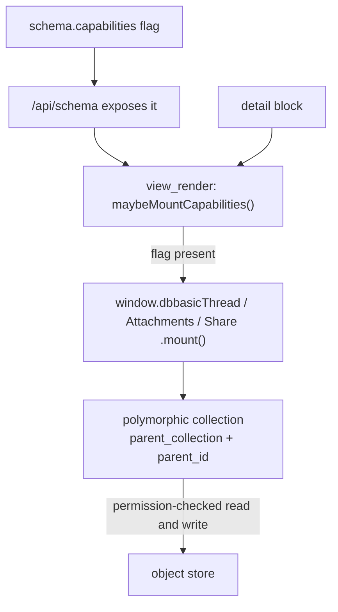
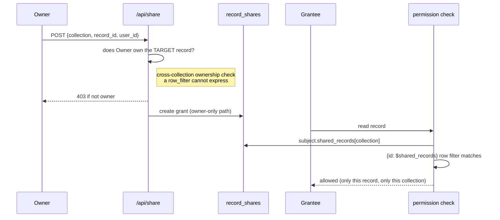

# Capabilities — Per-Collection Behaviors, Declared Not Coded

The schema-driven UI has two layers. The **display** layer turns a schema into
a list, table, board, form, and detail page (see
[`schema-forms.md`](schema-forms.md)). The **capability** layer sits on top of
it: generic *behaviors* a collection opts into by declaring a flag, wired by the
platform instead of hand-built per app.

A collection declares them under a root-level `capabilities` key:

```json
{
  "name": "tasks",
  "capabilities": { "comments": true, "attachments": true, "shareable": true },
  "fields": [ ... ]
}
```

and its detail page grows a comment thread, an attachment list, and a share
control — with no per-view block and no per-app table. The same three flags on
`contacts`, `invoices`, or any other collection give the same behaviors.

This is the "define once, project everywhere" rule applied to what a record
*does* and *connects to*, not just how it looks. It replaces the pattern where
every app hand-rolled its own version of the same idea: comments existed four
separate times (`task_comments`, `thread_comments`, `profile_comments`,
`interactions`) before one `capabilities.comments` flag collapsed them.

## The model

Each capability is one **polymorphic collection** (a row attaches to a record in
*any* collection via a `parent_collection` + `parent_id` pair), one **widget**
served as a static script like `/list` and `/form`, and one line in the detail
renderer that mounts the widget when the flag is present.



The wiring is one function, `maybeMountCapabilities` in
`app-views/objects/site/view_render.py`: it fetches the record's schema, reads
`capabilities`, and mounts each declared widget into its own sub-element under
the detail. Absent flag or unloaded widget → nothing renders, never an error.

`capabilities` is whitelisted in schema normalization
(`object_schemas.py`) and surfaced by `/api/schema` so the client can wire it —
the same "carried, not interpreted" posture as `flow` and `blocks`.

## The three capabilities

| Flag | Widget (route) | Backing collection | Package |
|------|----------------|--------------------|---------|
| `comments` | `window.dbbasicThread` (`/thread`) | `thread_comments` | `app-thread` |
| `attachments` | `window.dbbasicAttachments` (`/attachments`) | `files` (+`parent_*`) | `app-files` |
| `shareable` | `window.dbbasicShare` (`/share`) | `record_shares` | `app-share` |

### comments

A comment thread for one record. Reads/writes `thread_comments` filtered to the
`(parent_collection, parent_id)` pair, posts with a minimal payload (the server
owns `created_at`; `owner_id` is set from the session and redacted from other
readers, so each comment also stamps a display `author_name`), owner-only
delete, and re-renders over the change log like every other surface.

### attachments

An upload/list/download/delete surface for files attached to one record.
Uploads go multipart to `/api/files` — which owns `owner_id`/`size`/
`content_type` and saves the blob — carrying `parent_collection`/`parent_id` so
the file lands on this record. Delete is blob-aware (`DELETE /api/files/{id}`
removes the bytes *and* the metadata row; a plain record delete would orphan the
blob). No per-collection foreign key on `files` is needed.

### shareable

The foundational one — it changes the **permission check**, not just a widget.
A record's owner grants other users read (or write) access to that individual
record. See the security model below.

## Sharing: the security model

Sharing is the one capability that grants access, so it is designed so that a
grant can only ever *narrow* what a viewer could already reach, never widen it
for the granter's own benefit.



Three properties make it safe:

1. **Grants are minted only by `/api/share`.** `record_shares` has *no*
   create/update/delete permission rule, so a raw collection write can't forge
   one. The endpoint authorizes each grant against the **target record's**
   `owner_id` — a cross-collection fact a row filter can't check. A non-owner
   gets `403 "Only the record's owner can share it."`
2. **Reads resolve through the subject.** Before a check runs, the server builds
   `subject.shared_records` (per collection) from `record_shares`, the same way
   it builds `project_ids` from `project_access`. A collection opts in with a
   `{"id": "$shared_records"}` read rule.
3. **`$shared_records` is collection-aware.** The collection being checked is
   threaded through `_record_matches_filter → _resolve_filter_value`, so a share
   on a *task* never matches a same-id row in another collection. (Covered by
   `test_shared_records_filter_is_collection_scoped`.)

Verified end to end: a grantee reads a shared record (`200`), a non-grantee is
denied (`403`), and a non-owner cannot create a grant (`403`).

## Adding a new capability

The recipe, in order:

1. **A polymorphic collection** with `parent_collection` + `parent_id` (both
   *settable on create* — a field that is `required` **and** `read_only` can
   never be created through the HTTP write path, only a server-side
   `preserve_read_only` bypass).
2. **A widget** object at `site_{name}` serving `window.dbbasic{Name}` (public
   `execute` rule — it's a static script; the data it reads stays row-gated).
3. **Wire it** in `view_render`'s `maybeMountCapabilities` and add
   `<script src="/{name}">` to the view page.
4. **Adopt it** on a collection with `capabilities.{name}: true`. If the
   behavior grants access (like sharing), also add the permission rule.

Leave `owner_id` to the server on create — a field with a `public: hidden`
policy is server-set from the session and a client value is rejected.

## Related

- [`schema-forms.md`](schema-forms.md) — the display layer (forms, views, list
  modes) capabilities sit on top of.
- [`permissions-model.md`](permissions-model.md) — row/field filters, the
  `$`-variable row-filter language `$shared_records` extends, and sharing.
- [`ui-decisions.md`](ui-decisions.md) — decisions #7–#14, the living log of the
  generative-UI and capability behaviors (with the gotchas found building them).
