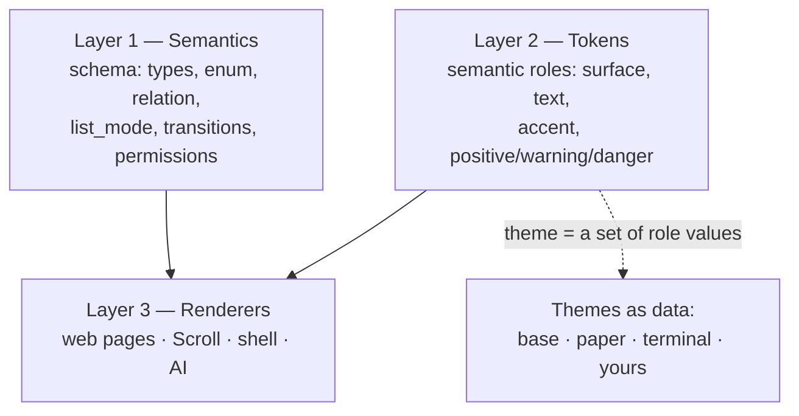

# The Design System

DBBASIC's design system is not a component library you depend on — it is
a **semantic contract with a thin, themeable renderer, delivered as an
object.** It has three layers, and only the top one is pixels.



## The governing idea: define once, project everywhere, own no copies

Everything below is one principle seen from different angles. State the
design once — as tokens, as a shared stylesheet object, as a nav object,
as a schema — and let every surface *project* it. No page owns a copy of
the theme; it references `/style`. No page owns a copy of the nav; it
includes `/nav`. No app hardcodes a widget; it declares a field's
meaning. Because nothing downstream owns a copy, changing the source
changes the whole product at once, with nothing to chase.

This is why rebranding the entire twelve-app suite and giving it a shared
navigation bar was **two objects edited live** — no deploy, no migration,
no per-page rework. If a future change to the look or the chrome ever
requires editing many pages, that is the signal that a copy leaked in and
should be pulled back into a shared object. Guard this property; it is the
whole value.

## Layer 1 — Semantics (the source of truth)

Design decisions live in the schema, not in markup. A field that declares
`enum` *means* "one of these values"; each surface picks its own control
(dropdown on the web, segmented control in Scroll, a spoken list to the
AI). `views.list_mode` picks table / cards / feed. `transitions` says
which state moves are legal. Permissions decide which controls exist at
all. See [schema forms](schema-forms.md) and [permissions](permissions-model.md).

**We deliberately do not use a widget-prescriptive `ui_schema`.** The
predecessor (q9) paired each schema with a React-JSON-Schema-Form
`ui_schema` that said things like `"ui:widget": "radio"`. That only ever
renders on one surface — a `radio` hint is meaningless to an AI, the
shell, a voice interface, or a native app. Semantics render everywhere;
widget instructions render once. This is the single most important choice
in the system, and the reason a design here can span surfaces that do not
exist yet.

**Permissions are affordances.** A control exists because the caller can
perform the action, not because markup drew it and then hid it. A delete
button appears when the policy allows delete; a project filter appears
because there is a `project_id` relation; a column appears because
`list_fields` lists it. The design system renders *capability* — which is
why an AI acting for a user, or a shared component, can never show a
control the user could not actually use.

## Layer 2 — Tokens (roles, not colors)

The visual vocabulary is a small set of **semantic roles** — surface
(`bg`, `panel`, `line`), text (`text`, `muted`), `accent`, and status
(`positive`, `warning`, `danger`) — plus spacing, radii, shadow, and two
type families. Components are written against the roles, never against
raw colors, so a retheme changes values in one place and nothing in any
page moves.

## Layer 3 — Renderers, and the design system *as an object*

The stylesheet is itself a DBBASIC object: **`site_style`, served at
`/style`.** Every page links to it (`<link rel="stylesheet" href="/style">`)
instead of carrying its own CSS. Because it is an object, the whole visual
system is versioned, rollback-able, and live-editable like everything
else — retheming is one reversible object change, not a deploy.

Other renderers consume the same two layers: Scroll's generated Flutter
forms and lists, the shell's terminal, and the AI (whose "UI" is the
schema's `label`/`help` text — good microcopy is design work that serves
the form, the accessibility label, and the AI tool description at once).

## The app shell — chrome contributed, not copied

Navigation is part of the design system, and it follows the same rule.
The **`site_nav` object, served at `/nav`,** injects one shared top bar
into every page that includes `<script src="/nav"></script>`: brand, an
app switcher across installed apps, global search (`⌘K` / `Ctrl-K`) over
`/api/search`, an Ask-AI link to the shell, a notification bell reading
the `notifications` collection, and a user menu (appearance, sign out).
Its styling lives in `/style`, so it themes with everything else.

The point is that a *package* (`app-theme`) contributes this bar to every
other app without those apps knowing — a thing a Django app could never do
to its siblings. Adding a nav item is one edit to one object; every app
gets it. If you find yourself pasting nav markup into a page, stop: add it
to `site_nav`.

The bell polls today, but it calls `window.dbbasicRenderNotes(records)` —
a hook a realtime push message will drive so the count updates the instant
something happens, across open pages. Auto-update on events is the thing
the old dashboard/Channels stacks never did cleanly, and it is the top
platform build (see [status](status.md)).

## Themes are data — and packages

A **theme is just a set of values for the token roles.** `site_style`
ships three built in:

- **base** — the DBBASIC identity: a warm dark (per the earth-theme rule
  "warm, not cold blue-black") with a terracotta/ember accent, carried
  forward from the palette q9 already established.
- **paper** — a warm light theme.
- **terminal** — high-contrast green-on-black.

The active theme lives in the object's state. There is a visual chooser
at **`/appearance`** (the `site_appearance` object): it reads the
available themes and their preview swatches from `/style?info=true` and
lets an admin click one to reskin the whole instance; non-admins see the
active theme read-only. Or switch over HTTP:

```http
POST /style   {"theme": "terminal"}          # admin session only
POST /style   {"tokens": {"accent": "#5aa7ff"}}   # custom role overrides
GET  /style?info=true                          # {active, available, previews, tokens}
```

`site_style` self-gates writes to admin sessions (using the unspoofable
injected identity), so a public `execute` grant can serve the CSS to
everyone while only operators change the look.

**A theme is a package.** Installing a package that ships its own
`site_style` (or that sets custom tokens) reskins the whole instance —
design distributed the same way apps are. A community can publish themes;
you install the one you like; you can fork it because it is one small,
readable object. Per-user theming (each account choosing a theme) is a
planned extension built on the same roles plus the `shell_preferences`
pattern.

## Forms, tables, search, and filters

The base stylesheet carries a genuinely complete component vocabulary so
generated UIs and hand-written pages share one look: form fields with
labels/help/required markers and validation states; tables with sortable
headers, hover, numeric alignment, and pagination; a toolbar with a search
input and filter chips; buttons as **intents** (primary / neutral /
danger) rather than colors; badges; and first-class empty / loading /
denied / error states.

That is the visual layer. The **generative renderer** that reads a schema
and emits these — the successor to q9's `django_tables2` + `django_filters`
(which worked because they were declarative from a single source) unified
across table, cards, and feed with search and filters wired to
`search.fields` — is the next build. q9's honest lesson is that this
substrate must be *one* renderer, not the four disconnected
implementations it grew (django_tables2 for tables, two incompatible
form engines, hand-written cards and feeds). The semantics and the token
vocabulary are now in place for it.

## Building a page against the design system

```html
<link rel="stylesheet" href="/style">
...
<div class="wrap">
  <header class="app"><h1>Notes</h1><div class="who">…</div></header>
  <div class="toolbar">
    <input class="search grow" placeholder="Search…">
    <div class="filters"><button class="chip" aria-pressed="true">All</button></div>
  </div>
  <div class="cards">…</div>
</div>
```

No inline CSS, no framework, no build step — just the shared classes. When
the instance's theme changes, this page changes with it. Page-unique
layout (a form's column grid, an edit-mode toggle) may stay in a small
`<style>` block, but it must use the token variables (`var(--panel)`,
`var(--line)`, `var(--accent)`) — never hardcoded colors — so it reskins
too.

## Why this is a design system, not a style guide

The test that separates the two: **change the source, and does the whole
product change with no copies to chase?** Here it does — edit `/style`,
every page reskins; edit `/nav`, every page's chrome updates; edit a
schema, every surface re-renders that field. A folder of CSS classes and a
component catalog is a style guide; you still hand-apply it and it drifts.
A design system propagates from one place. Protect that difference: the
day a change stops propagating is the day it quietly became a style guide.

## Why not a dashboard template

The web-template industry (Bootstrap admin themes, and the marketplaces
that sell them — q9 itself shipped on the "Volt" dashboard) assumed
**everything is a dashboard**: a fixed chrome of sidebar, topbar, cards,
and a data table, into which you pour your app. That is widgets-before-
meaning — the shape is the product, and the only app you can express is
the one the widgets already draw. It is the same mistake as a
widget-prescriptive `ui_schema`, at the scale of a whole product. It is
also why q9 accumulated 110 KB of override CSS *fighting* its template:
when the chrome is copied into every page, changing it means fighting it
everywhere.

Reading modes (`table` / `cards` / `feed`) are the direct rejection of the
one-shape assumption: a note is read individually (cards), a task is
compared to others (table), a message is sequential (feed). The dashboard
world only had the table.

The reason no one built it this way earlier is not taste, it is
arithmetic. Projecting one schema into a web form, a table, a Flutter
widget, an AI tool description, and an accessibility label meant
hand-writing five renderers per app — insane in 2015, so buying the frozen
template was rational. What changed is that the schema is now legible to a
model, a model can render a surface, and the runtime hot-loads it with no
deploy — so the marginal cost of a surface collapsed, and the correct
architecture (declare meaning once, project everywhere) finally pays. Build
for that, not for the dashboard era.

## Current edges (honest)

- **Theme-complete, component-incomplete.** The token/theme/app-shell
  layers are done and propagate. The component *vocabulary* exists in
  `/style`, but pages still assemble it by hand — the **generative
  renderer** (schema → dense list with row actions, filters, and relative
  timestamps) is not built yet. It is the next big design build, and it
  needs a `created_at` field added to schemas first (nothing captures
  creation time today, so there are no relative timestamps to show).
- **Web + tokens today.** Scroll shares the token *roles* but the web and
  Flutter renderers are not unified against one contract yet.
- **Instance-level theming.** Per-user theme choice is a planned extension
  on the same roles plus `shell_preferences`.
- **The shell page** (`/shell`) deliberately keeps its own terminal palette
  and does not link `/style` or `/nav` — a focused full-screen mode. The
  admin dashboard is not yet on the shared shell either.

## Extending it correctly — rules for future builds

When adding to the design system, keep the propagation property intact:

1. **Contribute, don't copy.** New chrome goes in a shared object
   (`site_style`, `site_nav`), never pasted into pages. If it must live in
   a page, it is page-unique and must use tokens.
2. **Tokens are roles, never hex.** Add a role (e.g. `--info`) if you need
   a new meaning; never a raw color in a component or a page.
3. **Semantics, not widgets.** Express new capability as schema meaning
   (a new field key, a new `views` mode) that every surface can interpret
   — resist any per-surface "render as X" instruction; that is `ui_schema`
   returning, and it collapses you back to one surface.
4. **Let permissions draw the controls.** Show an action because the
   policy allows it, not because you wrote the button.
5. **One renderer per concern.** When the generative renderer lands, route
   all lists/forms through it — do not grow a second form engine. q9 grew
   four; that fragmentation is the failure mode to avoid.
6. **No framework to fight.** Do not adopt a CSS framework you will then
   override. The system is small and authoritative on purpose.
7. **If a change stops propagating, fix the leak** — pull the copy back
   into the shared object — rather than editing many pages.

Follow these and the next person (or the next model, or a stranger who
forks this) can retheme, re-chrome, or extend the whole product from a
handful of objects — which is the point.
