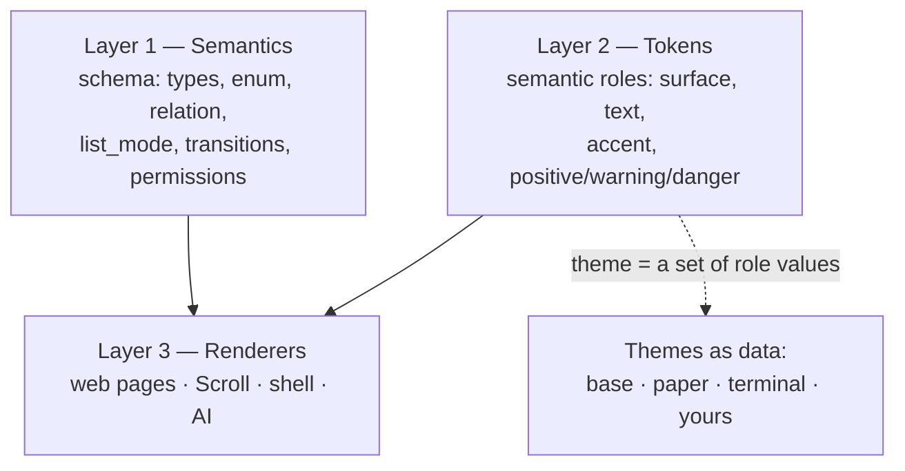

# The Design System

DBBASIC's design system is not a component library you depend on — it is
a **semantic contract with a thin, themeable renderer, delivered as an
object.** It has three layers, and only the top one is pixels.



## Layer 1 — Semantics (the source of truth)

Design decisions live in the schema, not in markup. A field that declares
`enum` *means* "one of these values"; each surface picks its own control
(dropdown on the web, segmented control in Scroll, a spoken list to the
AI). `views.list_mode` picks table / cards / feed. `transitions` says
which state moves are legal. Permissions decide which controls exist at
all. See [schema forms](schema-forms.md) and [permissions](permissions-model.md).

**We deliberately do not use a widget-prescriptive `ui_schema`.** The
predecessor (q9) paired each schema with a React-JSON-Schema-Form
`ui_schema` that said things like `"ui:widget": "radio"`. That only ever
renders on one surface — a `radio` hint is meaningless to an AI, the
shell, a voice interface, or a native app. Semantics render everywhere;
widget instructions render once. This is the single most important choice
in the system, and the reason a design here can span surfaces that do not
exist yet.

## Layer 2 — Tokens (roles, not colors)

The visual vocabulary is a small set of **semantic roles** — surface
(`bg`, `panel`, `line`), text (`text`, `muted`), `accent`, and status
(`positive`, `warning`, `danger`) — plus spacing, radii, shadow, and two
type families. Components are written against the roles, never against
raw colors, so a retheme changes values in one place and nothing in any
page moves.

## Layer 3 — Renderers, and the design system *as an object*

The stylesheet is itself a DBBASIC object: **`site_style`, served at
`/style`.** Every page links to it (`<link rel="stylesheet" href="/style">`)
instead of carrying its own CSS. Because it is an object, the whole visual
system is versioned, rollback-able, and live-editable like everything
else — retheming is one reversible object change, not a deploy.

Other renderers consume the same two layers: Scroll's generated Flutter
forms and lists, the shell's terminal, and the AI (whose "UI" is the
schema's `label`/`help` text — good microcopy is design work that serves
the form, the accessibility label, and the AI tool description at once).

## Themes are data — and packages

A **theme is just a set of values for the token roles.** `site_style`
ships three built in:

- **base** — the DBBASIC identity: a warm dark (per the earth-theme rule
  "warm, not cold blue-black") with a terracotta/ember accent, carried
  forward from the palette q9 already established.
- **paper** — a warm light theme.
- **terminal** — high-contrast green-on-black.

The active theme lives in the object's state. Switch it live:

```http
POST /style   {"theme": "terminal"}          # admin session only
POST /style   {"tokens": {"accent": "#5aa7ff"}}   # custom role overrides
GET  /style?info=true                          # {active, available, tokens}
```

`site_style` self-gates writes to admin sessions (using the unspoofable
injected identity), so a public `execute` grant can serve the CSS to
everyone while only operators change the look.

**A theme is a package.** Installing a package that ships its own
`site_style` (or that sets custom tokens) reskins the whole instance —
design distributed the same way apps are. A community can publish themes;
you install the one you like; you can fork it because it is one small,
readable object. Per-user theming (each account choosing a theme) is a
planned extension built on the same roles plus the `shell_preferences`
pattern.

## Forms, tables, search, and filters

The base stylesheet carries a genuinely complete component vocabulary so
generated UIs and hand-written pages share one look: form fields with
labels/help/required markers and validation states; tables with sortable
headers, hover, numeric alignment, and pagination; a toolbar with a search
input and filter chips; buttons as **intents** (primary / neutral /
danger) rather than colors; badges; and first-class empty / loading /
denied / error states.

That is the visual layer. The **generative renderer** that reads a schema
and emits these — the successor to q9's `django_tables2` + `django_filters`
(which worked because they were declarative from a single source) unified
across table, cards, and feed with search and filters wired to
`search.fields` — is the next build. q9's honest lesson is that this
substrate must be *one* renderer, not the four disconnected
implementations it grew (django_tables2 for tables, two incompatible
form engines, hand-written cards and feeds). The semantics and the token
vocabulary are now in place for it.

## Building a page against the design system

```html
<link rel="stylesheet" href="/style">
...
<div class="wrap">
  <header class="app"><h1>Notes</h1><div class="who">…</div></header>
  <div class="toolbar">
    <input class="search grow" placeholder="Search…">
    <div class="filters"><button class="chip" aria-pressed="true">All</button></div>
  </div>
  <div class="cards">…</div>
</div>
```

No inline CSS, no framework, no build step — just the shared classes. When
the instance's theme changes, this page changes with it.
