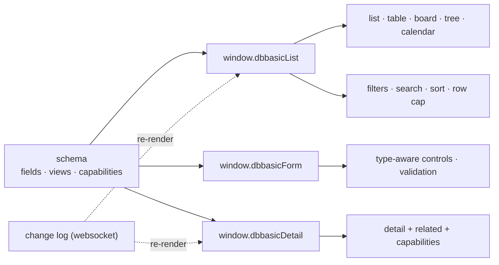

# Generative UI — One Renderer, Every App

There is no per-app UI code. A collection's schema drives a single set of
generative renderers, served as static scripts (`/list`, `/form`, `/detail`),
that turn records into live, permission-checked, realtime surfaces. This page
is the overview; the field-level contract is in
[`schema-forms.md`](schema-forms.md), the behavior decisions in
[`ui-decisions.md`](ui-decisions.md), and the visual system in
[`design-system.md`](design-system.md).

## The list, in five modes

`window.dbbasicList(collection, cfg)` resolves `views.list_mode` from the
schema and renders one of:

- **list** (default) — rich rows: avatar, title, subtitle, meta, tag pills,
  owner edit/delete.
- **table** — a dense, sortable HTML table over `list_fields`; cells format by
  type (money `_cents` → `$`, boolean → Yes/No, datetime → relative, enum →
  colored badge), and **relation columns show the target's label, not the raw
  id**. Owned rows get the same edit/delete the list has.
- **board** — a kanban grouped by an enum field; dragging a card issues the
  ordinary status write, so `flow` transitions still gate the move. A board
  collection that also has `list_fields` shows a **Board ⇄ Table** toggle whose
  choice persists per collection.
- **tree** — nests a self-relation (`parent_id`) into a hierarchy.
- **calendar** — buckets records by a date field.

Every mode shares **one** fetch/sort/cap/search/subscribe pipeline, so all of
them inherit:

- **filters** — `views.filter_fields` renders a filter bar (enum → select,
  boolean → Yes/No); a pick narrows the fetch server-side (`field=value`, after
  the permission row filter) and composes with the search box.
- **search** — the toolbar box, server-side over the collection's `search`
  fields.
- **the 50-row cap** with a Show-all toggle (no surface ever renders a
  50,000px page).
- **realtime** — each surface subscribes to the change log and re-renders when
  a record changes, from any tab, user, or agent.

A mode whose required field can't be derived (no enum for board, no
self-relation for tree, no date for calendar) falls back to the row list with a
visible notice — never a blank page.

## The form

`window.dbbasicForm(collection)` builds a record form from the schema: field
order from `forms.default.fields`, controls from field semantics (enum →
select, relation → picker, boolean → checkbox, date → date input, textarea,
number, text), and labels/help/required/max-length from the field. It handles
create (POST) and edit (PUT), sets `id`/`owner_id`/`created_at` automatically,
never writes computed/read-only fields, and supports conditional field
visibility (`visible_when`). See [`schema-forms.md`](schema-forms.md).

## The detail page

`window.dbbasicDetail` renders one record read-only by reusing the form's own
field renderer in read-only mode — no second field renderer to keep in sync. It
adds owner-only Edit/Delete (reusing the form's edit pipeline), always shows
record metadata (`created_at`/`updated_at`) even when `detail_fields` curates
the main fields, and auto-mounts any declared **capabilities** (comments,
attachments, sharing — see [`capabilities.md`](capabilities.md)) below the
detail. Composed detail pages are `views` records with a `detail` block plus
`related` child blocks; the view renderer
(`app-views/objects/site/view_render.py`) assembles them.

## Why this is the point

Adding an app is a schema file. The list, the table, the board, the toggle,
the filters, the form, the detail page, badges, the row cap, relation labels,
realtime, and owner actions all fall out of it — the same code for every app.
The measure isn't the feature list (anyone can claim those); it's the amount of
per-app code, which is a schema and at most one page object.

## Related

- [`schema-forms.md`](schema-forms.md) — the field-level contract these
  renderers read.
- [`ui-decisions.md`](ui-decisions.md) — the living log of interaction
  decisions (detail-vs-edit, the row cap, board flex, filters, relation labels,
  capabilities) and the reasons behind them.
- [`design-system.md`](design-system.md) — semantic tokens, themes as data, and
  the stylesheet served as an object.
- [`capabilities.md`](capabilities.md) — the behavior layer mounted on detail.
