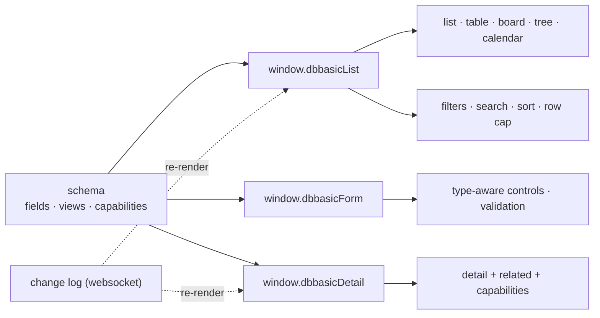

# Generative UI — One Renderer, Every App

There is no per-app UI code. A collection's schema drives a single set of
generative renderers, served as static scripts (`/list`, `/form`, `/detail`),
that turn records into live, permission-checked, realtime surfaces. This page
is the overview; the field-level contract is in
[`schema-forms.md`](schema-forms.md), the behavior decisions in
[`ui-decisions.md`](ui-decisions.md), and the visual system in
[`design-system.md`](design-system.md).

```mermaid
flowchart LR
    SCH["schema<br/>fields · views · capabilities"] --> LIST["window.dbbasicList"]
    SCH --> FORM["window.dbbasicForm"]
    SCH --> DET["window.dbbasicDetail"]
    LIST --> MODES["list · table · board · tree · calendar"]
    LIST --> FSR["filters · search · sort · row cap"]
    FORM --> CTRL["type-aware controls · validation"]
    DET --> COMP["detail + related + capabilities"]
    CL["change log (websocket)"] -. re-render .-> LIST
    CL -. re-render .-> DET
```

## The list, in five modes

`window.dbbasicList(collection, cfg)` resolves `views.list_mode` from the
schema and renders one of:

- **list** (default) — rich rows: avatar, title, subtitle, meta, tag pills,
  owner edit/delete.
- **table** — a dense, sortable HTML table over `list_fields`; cells format by
  type (money `_cents` → `$`, boolean → Yes/No, datetime → relative, enum →
  colored badge), and **relation columns show the target's label, not the raw
  id**. Owned rows get the same edit/delete the list has.
- **board** — a kanban grouped by an enum field; dragging a card issues the
  ordinary status write, so `flow` transitions still gate the move. A board
  collection that also has `list_fields` shows a **Board ⇄ Table** toggle whose
  choice persists per collection.
- **tree** — nests a self-relation (`parent_id`) into a hierarchy.
- **calendar** — buckets records by a date field.

Every mode shares **one** fetch/sort/cap/search/subscribe pipeline, so all of
them inherit:

- **filters** — `views.filter_fields` renders a filter bar (enum → select,
  boolean → Yes/No); a pick narrows the fetch server-side (`field=value`, after
  the permission row filter) and composes with the search box.
- **search** — the toolbar box, server-side over the collection's `search`
  fields.
- **the 50-row cap** with a Show-all toggle (no surface ever renders a
  50,000px page).
- **realtime** — each surface subscribes to the change log and re-renders when
  a record changes, from any tab, user, or agent.

A mode whose required field can't be derived (no enum for board, no
self-relation for tree, no date for calendar) falls back to the row list with a
visible notice — never a blank page.

## The form

`window.dbbasicForm(collection)` builds a record form from the schema: field
order from `forms.default.fields`, controls from field semantics (enum →
select, relation → picker, boolean → checkbox, date → date input, textarea,
number, text), and labels/help/required/max-length from the field. It handles
create (POST) and edit (PUT), sets `id`/`owner_id`/`created_at` automatically,
never writes computed/read-only fields, and supports conditional field
visibility (`visible_when`). See [`schema-forms.md`](schema-forms.md).

## The detail page

`window.dbbasicDetail` renders one record read-only by reusing the form's own
field renderer in read-only mode — no second field renderer to keep in sync. It
adds owner-only Edit/Delete (reusing the form's edit pipeline), always shows
record metadata (`created_at`/`updated_at`) even when `detail_fields` curates
the main fields, and auto-mounts any declared **capabilities** (comments,
attachments, sharing — see [`capabilities.md`](capabilities.md)) below the
detail. Composed detail pages are `views` records with a `detail` block plus
`related` child blocks; the view renderer
(`app-views/objects/site/view_render.py`) assembles them.

## Why this is the point

Adding an app is a schema file. The list, the table, the board, the toggle,
the filters, the form, the detail page, badges, the row cap, relation labels,
realtime, and owner actions all fall out of it — the same code for every app.
The measure isn't the feature list (anyone can claim those); it's the amount of
per-app code, which is a schema and at most one page object.

## This is not scaffolding

Rails scaffolds and Django's startapp share one failure that defined a
generation of frameworks: the generator emits **code**, you edit it, and from
that moment you own all of it. The generator can never help that screen again
— template improvements don't flow, upgrades don't apply, and nothing records
which parts you changed. The fork happens at generation time and diverges
silently forever. "Eject" is the same failure with a button on it.

The rule that keeps this system on the other side of that line:

> **Generated output is never materialized, so it can never be edited.**
> A page is a view record *interpreted at request time* by a renderer that is
> itself an ordinary object. Customizing never means editing emitted code,
> because there is no emitted code. You either change **data** (and keep
> receiving renderer improvements) or you write **your own object** (which was
> never generated, so nothing was forked).

### The customization ladder

Each rung says exactly what you take ownership of and what keeps flowing:

1. **Edit the block config** (filters, `title_field`, sort, `row_limit`) — you
   own the config; every renderer improvement still flows.
2. **Add blocks** — a view is a list of blocks; put an `aggregate` summary or
   `markdown` intro above the generated list. Same ownership as (1).
3. **Customize a shipped view record** — the upgrade system detects it against
   the package baseline and parks a reconcile instead of clobbering: the system
   *records* what you own and shows you when upstream moved. Scaffolding's
   fork is silent; this one has a ledger.
4. **Drop an `object` block into a generated page** — one hand-written panel
   among generated ones (`{"kind": "object", "object_id": "site_my_panel"}`).
   You own that panel; the rest of the page keeps flowing. It runs through the
   ordinary execution path, so permissions and audit apply — the block widens
   what a page can *show*, never what a viewer may *see*.
5. **Write the whole page object.** Convention routing means creating
   `site/notes.py` instantly overrides the generated `/notes` — and deleting
   the file reverts to it. The override is total, explicit, and reversible,
   and it is visible in the objects listing rather than buried in a diff
   against generator output.

### Why replacing a page is safe here and wasn't in Rails

The deep failure of scaffolds wasn't the HTML — it was that the scaffold
contained **rules** (validations in the controller, logic in the view), so
editing it forked the rules. Here the doctrine is that *a page may never be
the only place a rule exists*: enforcement lives in the schema, hooks,
transitions, and permissions, on the shared write path that the JSON API, MCP
agents, and the websocket all go through.

That doctrine is not just policy — the architecture makes the wrong place
**fail loudly**. A rule written into a page object simply does not gate API or
MCP writes, so the mistake shows up the first time anything that isn't the
page touches the collection. In Rails, logic in the controller *worked* for
web users, which is exactly why the fork stayed invisible for years. The
residual risk here is someone treating rung 4–5 as a place to put gates; the
system's answer is that gates there provably don't hold, and the hook is one
file away.

## Related

- [`schema-forms.md`](schema-forms.md) — the field-level contract these
  renderers read.
- [`ui-decisions.md`](ui-decisions.md) — the living log of interaction
  decisions (detail-vs-edit, the row cap, board flex, filters, relation labels,
  capabilities) and the reasons behind them.
- [`design-system.md`](design-system.md) — semantic tokens, themes as data, and
  the stylesheet served as an object.
- [`capabilities.md`](capabilities.md) — the behavior layer mounted on detail.
