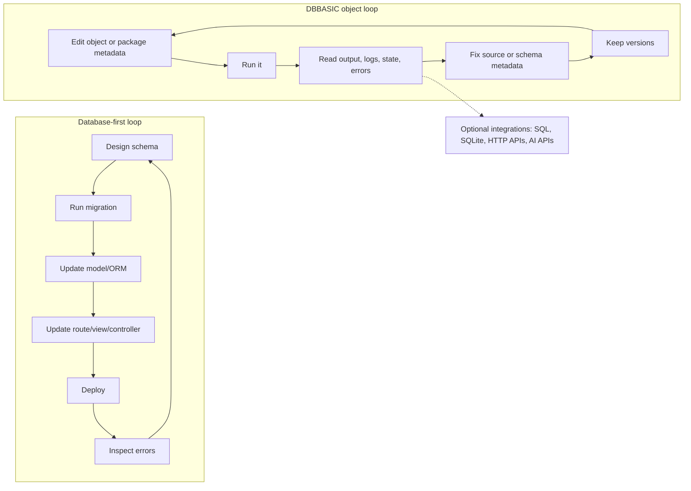
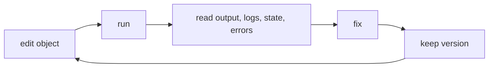

# Object Authoring

This document describes the object shape supported by the current public server
slice. It is intentionally small and should stay compatible with the working
private runtime while the hardened runtime moves into this repository.

## Source Location

Object source lives under `objects/` by default:

```text
objects/site/home.py
objects/basics/counter.py
objects/users/42/deals.py
```

The source root can be changed for deployments:

```text
DBBASIC_OBJECTS_DIR=/var/lib/dbbasic-object-server/objects
```

Object IDs are derived from paths:

- `objects/site/home.py` becomes `site_home`
- `objects/basics/counter.py` becomes `basics_counter`
- `objects/users/42/deals.py` becomes `u_42_deals`

## Methods

An object is a Python file that can define HTTP-style methods:

```python
def GET(request):
    return {"status": "ok"}

def POST(request):
    return {"status": "created", "payload": request}
```

`GET` receives query parameters. `POST`, `PUT`, and `DELETE` receive the parsed
request body plus query parameters where the HTTP contract allows it.

## Request Identity

Every request payload includes a server-controlled `_identity` key describing
the resolved caller, so objects can render per-user pages and make per-user
decisions without hand-rolling auth:

```python
def GET(request):
    identity = request["_identity"]
    if identity["user_id"] is None:
        return {"status": 401, "error": "Sign in first"}
    return {"hello": identity["user_id"], "roles": identity["roles"]}
```

`_identity` contains `user_id`, `account_id`, `roles`, `subscriptions`, and
`auth_method` (`admin_token`, `session_token`, `session_cookie`,
`trusted_headers`, or `anonymous`). The server overwrites any client-supplied
`_identity` value before the object runs, so it cannot be spoofed through the
request body or query string. Anonymous requests still receive the key with
`user_id` set to `None`.

## Runtime Helpers

Loaded object modules receive a small set of runtime helpers. The current public
runtime injects:

```python
_state_manager.get(key, default=None)
_state_manager.set(key, value)
_state_manager.get_all()
_state_manager.reload()

_logger.debug(message, **fields)
_logger.info(message, **fields)
_logger.warning(message, **fields)
_logger.error(message, **fields)
```

State is stored under `data/state/{object_id}/state.tsv`. Logs are stored under
`data/logs/{object_id}/log.tsv`. The active log is plain TSV. Rotated logs are
gzip-compressed by default and can still be read by the server.

## Default Storage And Integrations

The default DBBASIC object should not need a separate database. Source, state,
logs, files, and versions are file-backed so a useful app can start on one VM
with normal Unix paths and backups.

Objects can still connect to SQL databases, SQLite files, HTTP APIs, AI APIs, or
other services when a workload needs them. Those integrations should be explicit
object behavior or package behavior, not hidden platform requirements.

This keeps the base stack small while leaving room for:

- SQL/reporting objects
- schema and relationship inspectors
- API connector objects
- migration objects
- AI-assisted query and data tools

DBBASIC Scroll can expose SQL, schema, and diagram screens, but those should be
capabilities of the object system rather than proof that every app needs a
database tier by default.

Schema still matters. The difference is that DBBASIC should let schemas,
validation rules, relationships, and generated admin screens live close to the
objects and packages that use them. That avoids forcing every small app through
an external database, migration, ORM, admin, and deployment loop before the app
has proved it needs that weight.



## JSON Object

```python
def GET(request):
    count = int(_state_manager.get("count", 0)) + 1
    _state_manager.set("count", count)
    _logger.info("counter served", count=count)
    return {
        "status": "ok",
        "count": count,
    }
```

Normal dictionaries return JSON.

## HTML Object

```python
def GET(request):
    count = int(_state_manager.get("count", 0)) + 1
    _state_manager.set("count", count)
    _logger.info("home served", count=count, response_type="html")

    html = f"""<!doctype html>
<html lang="en">
<head>
  <meta charset="utf-8">
  <meta name="viewport" content="width=device-width, initial-scale=1">
  <title>DBBASIC Object</title>
</head>
<body>
  <h1>DBBASIC Object</h1>
  <p>This object has been served {count} times.</p>
</body>
</html>
"""

    return {
        "content_type": "text/html; charset=utf-8",
        "body": html,
    }
```

Dicts with `content_type` and `body` become raw HTTP responses. This is the
shape used for pages, generated views, images, and other non-JSON object
responses.

Plain strings also return `text/html; charset=utf-8`. Plain bytes return
`application/octet-stream`.

## HTML Form Object

Forms are how design changes ship without a deploy: the page, the handler, and
the state live in one object. `GET` renders the form; `POST` receives the
submitted fields (form posts from a signed-in browser carry the session cookie,
so `request["_identity"]` identifies the user in both methods):

```python
def GET(request):
    identity = request["_identity"]
    if identity["user_id"] is None:
        return (303, [("Location", "/login?next=/objects/notes_quick")], b"")

    saved = _state_manager.get(f"note:{identity['user_id']}", "")
    html = f"""<!doctype html>
<html lang="en">
<body>
  <h1>Quick note for {identity['user_id']}</h1>
  <form method="post">
    <textarea name="note">{saved}</textarea>
    <button type="submit">Save</button>
  </form>
</body>
</html>"""
    return {"content_type": "text/html; charset=utf-8", "body": html}


def POST(request):
    identity = request["_identity"]
    if identity["user_id"] is None:
        return {"status": 401, "error": "Sign in first"}

    _state_manager.set(f"note:{identity['user_id']}", str(request.get("note", "")))
    _logger.info("note saved", user_id=identity["user_id"])
    return (303, [("Location", "/objects/notes_quick")], b"")
```

Cookie-authenticated form posts are origin-checked by the server (same-site
only), so objects do not need their own CSRF plumbing for basic forms. Records
and schemas are the step up from object state when the data needs listing,
validation, and change history — see the collections sections of
`http-api-contract.md`.

## Upload Forms

`multipart/form-data` posts (forms with `enctype="multipart/form-data"`) are
parsed for you: text fields arrive as plain payload keys, and each uploaded
file arrives under `request["_files"]` with its content base64-encoded so the
payload survives the subprocess execution boundary:

```python
import base64

def POST(request):
    upload = request["_files"]["document"]
    content = base64.b64decode(upload["content_base64"])
    _logger.info("upload received", filename=upload["filename"], size=upload["size"])
    return {"saved": upload["filename"], "bytes": len(content)}
```

Each `_files` entry has `filename`, `content_type`, `size`, and
`content_base64`. Upload size is bounded by `DBBASIC_MAX_REQUEST_BYTES`.
Store durable uploads through the object file APIs so they inherit
permissions and change history.

## Low-Level Response

When an object needs exact status and headers, return a tuple:

```python
def POST(request):
    return (201, [("Content-Type", "text/plain")], [b"created"])
```

The tuple shape is:

```text
(status, headers, body)
```

`body` may be bytes, text, or a list of bytes/text parts.

## Authoring Rule

Keep each object small enough to inspect, run, log, fix, and version quickly.
The point of DBBASIC is the short loop:



Objects can call other objects, emit events, handle jobs, serve pages, or expose
APIs, but the first rule is the same: make the running object easy to inspect.

## Public Deployment Safety

Until role, object, and row-level permissions are enforced, do not expose the
full `/objects` API on a public hostname.

For public staging:

- keep `DBBASIC_ENABLE_SOURCE_WRITES=false`
- generate a deployment-specific `DBBASIC_ADMIN_TOKEN` outside the source tree
- bind uvicorn to `127.0.0.1`
- allowlist explicit public object routes in a reverse proxy
- keep object source, state, logs, versions, and object listing private from
  normal public users
