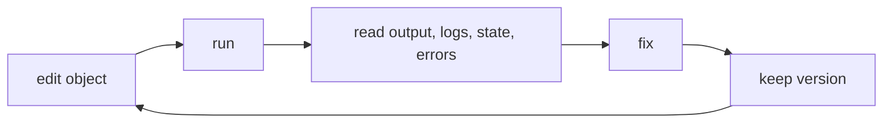

# Object Authoring

This document describes the object shape supported by the current public server
slice. It is intentionally small and should stay compatible with the working
private runtime while the hardened runtime moves into this repository.

## Source Location

Object source lives under `objects/` by default:

```text
objects/site/home.py
objects/basics/counter.py
objects/users/42/deals.py
```

The source root can be changed for deployments:

```text
DBBASIC_OBJECTS_DIR=/var/lib/dbbasic-object-server/objects
```

Object IDs are derived from paths:

- `objects/site/home.py` becomes `site_home`
- `objects/basics/counter.py` becomes `basics_counter`
- `objects/users/42/deals.py` becomes `u_42_deals`

## Methods

An object is a Python file that can define HTTP-style methods:

```python
def GET(request):
    return {"status": "ok"}

def POST(request):
    return {"status": "created", "payload": request}
```

`GET` receives query parameters. `POST`, `PUT`, and `DELETE` receive the parsed
request body plus query parameters where the HTTP contract allows it.

## Runtime Helpers

Loaded object modules receive a small set of runtime helpers. The current public
runtime injects:

```python
_state_manager.get(key, default=None)
_state_manager.set(key, value)
_state_manager.get_all()
_state_manager.reload()

_logger.debug(message, **fields)
_logger.info(message, **fields)
_logger.warning(message, **fields)
_logger.error(message, **fields)
```

State is stored under `data/state/{object_id}/state.tsv`. Logs are stored under
`data/logs/{object_id}/log.tsv`.

## JSON Object

```python
def GET(request):
    count = int(_state_manager.get("count", 0)) + 1
    _state_manager.set("count", count)
    _logger.info("counter served", count=count)
    return {
        "status": "ok",
        "count": count,
    }
```

Normal dictionaries return JSON.

## HTML Object

```python
def GET(request):
    count = int(_state_manager.get("count", 0)) + 1
    _state_manager.set("count", count)
    _logger.info("home served", count=count, response_type="html")

    html = f"""<!doctype html>
<html lang="en">
<head>
  <meta charset="utf-8">
  <meta name="viewport" content="width=device-width, initial-scale=1">
  <title>DBBASIC Object</title>
</head>
<body>
  <h1>DBBASIC Object</h1>
  <p>This object has been served {count} times.</p>
</body>
</html>
"""

    return {
        "content_type": "text/html; charset=utf-8",
        "body": html,
    }
```

Dicts with `content_type` and `body` become raw HTTP responses. This is the
shape used for pages, generated views, images, and other non-JSON object
responses.

Plain strings also return `text/html; charset=utf-8`. Plain bytes return
`application/octet-stream`.

## Low-Level Response

When an object needs exact status and headers, return a tuple:

```python
def POST(request):
    return (201, [("Content-Type", "text/plain")], [b"created"])
```

The tuple shape is:

```text
(status, headers, body)
```

`body` may be bytes, text, or a list of bytes/text parts.

## Authoring Rule

Keep each object small enough to inspect, run, log, fix, and version quickly.
The point of DBBASIC is the short loop:



Objects can call other objects, emit events, handle jobs, serve pages, or expose
APIs, but the first rule is the same: make the running object easy to inspect.

## Public Deployment Safety

Until server-side auth and permissions are enforced, do not expose the full
`/objects` API on a public hostname.

For public staging:

- keep `DBBASIC_ENABLE_SOURCE_WRITES=false`
- bind uvicorn to `127.0.0.1`
- allowlist explicit public object routes in a reverse proxy
- keep object source, state, logs, versions, and object listing private
