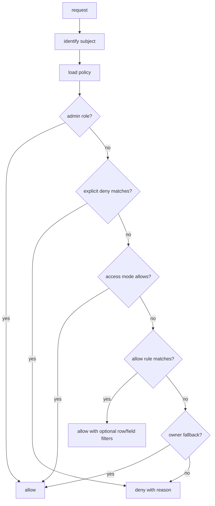
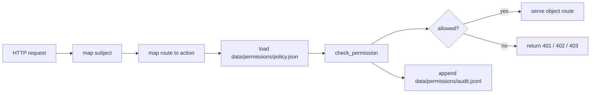

# Permissions Model

DBBASIC permissions are a server-side primitive. Scroll can edit, preview, and
explain rules, but the object server must make the final allow/deny decision.

Many web frameworks treat permissions as something each app has to rediscover:
blog visibility, admin-only pages, intranet roles, or social-app follows. Those
cases matter, but they are not enough for a general business platform.

DBBASIC needs object-level permissions that can model SaaS, customer portals,
employee roles, contractors, paid content, shared workspaces, internal admin
tools, and AI-generated app surfaces with the same small set of primitives.
Getting this right means most apps need less custom permission code.

The model needs to cover the common app cases without forcing every object into
one framework shape:

- public visitors
- signed-in users
- paid subscribers
- temporary paid access
- admins and employees
- customer accounts with their own employees
- object owners
- users or accounts an owner shared with
- per-row and per-field restrictions

## Decision Shape

The core API is:

```python
check_permission(subject, action, policy, collection=None, object_id=None, record=None)
```

It returns:

```python
PermissionDecision(
    allowed=True/False,
    reason="...",
    code="allowed|authentication_required|payment_required|forbidden",
    http_status=200|401|402|403,
    row_filter={...},
)
```

When a list/query request has a row filter but no specific record, the decision
can return `allowed=True` with the row filter attached. The caller then applies
that filter before returning rows.



## Persistence And API

The current public server stores the active policy as:

```text
data/permissions/policy.json
```

If the file does not exist, the server uses a conservative default:

```json
{
  "access_mode": "role_based",
  "roles": {},
  "user_roles": {},
  "rules": [],
  "admin_roles": ["admin", "superuser"]
}
```

The policy endpoints are admin-gated until real user sessions exist:

```http
GET /permissions/policy
Authorization: Token <token>
```

```http
PUT /permissions/policy
Authorization: Token <token>
Content-Type: application/json
```

```json
{
  "policy": {
    "access_mode": "role_based",
    "roles": {"sales": {"label": "Sales"}},
    "user_roles": {"7": ["sales"]},
    "rules": []
  }
}
```

Scroll and tests can preview decisions without persisting draft rules:

```http
POST /permissions/check
Authorization: Token <token>
Content-Type: application/json
```

```json
{
  "policy": {
    "access_mode": "role_based",
    "rules": [
      {
        "effect": "allow",
        "principal": "role:sales",
        "actions": ["read"],
        "collection": "contacts",
        "row_filter": {"owner_id": "$user_id"}
      }
    ]
  },
  "subject": {"user_id": "7", "roles": ["sales"]},
  "action": "read",
  "collection": "contacts"
}
```

If `policy` is omitted, `/permissions/check` uses the persisted policy file.
The optional `now` field accepts an ISO timestamp for testing temporary access
windows.

## Route Enforcement

The public server can enforce the persisted policy against object routes, but it
is intentionally opt-in while auth and Scroll editing mature.

```text
DBBASIC_ENABLE_PERMISSION_ENFORCEMENT=true
```

When enforcement is enabled, object routes call the same decision engine before
serving or executing an object:



Route actions currently map like this:

- `GET /objects/{id}` -> `execute`
- `POST /objects/{id}` -> `execute`
- `PUT /objects/{id}` -> `update`
- `DELETE /objects/{id}` -> `delete`
- `?source=true` -> `source`
- `?state=true` -> `state`
- `?logs=true` -> `logs`
- `?versions=true` or `?version=N` -> `versions`
- `?metadata=true` -> `read`

Audit-only mode logs decisions without blocking the request:

```text
DBBASIC_ENABLE_PERMISSION_AUDIT=true
```

That is useful before turning enforcement on for a live app. Enforcement also
writes audit entries.

Operators and Scroll can read recent audit entries through the admin-gated audit
endpoint:

```http
GET /permissions/audit?limit=100&object_id=site_home
Authorization: Token <token>
```

Supported filters are `action`, `object_id`, `collection`, `allowed`, and
`enforced`.

By default, route checks only trust the admin token and anonymous public traffic.
If a reverse proxy or auth gateway has already authenticated the request, trusted
identity headers can be enabled explicitly:

```text
DBBASIC_PERMISSION_TRUST_HEADERS=true
```

Supported headers:

- `X-DBBASIC-User-Id`
- `X-DBBASIC-Account-Id`
- `X-DBBASIC-Roles`
- `X-DBBASIC-Subscriptions`

Only enable trusted headers behind infrastructure that strips or overwrites
client-supplied copies.

## Access Modes

Access modes answer who gets through the front door.

- `public` - anyone can read or execute public objects.
- `password` - a shared gate authenticates before policy checks.
- `registered` - any signed-in user can read or execute.
- `subscription` - signed-in users with an active subscription can read or
  execute.
- `role_based` - rules decide by role, user, account, owner, row, field, and
  action.
- `private` - owner-only fallback unless explicit rules grant access.

## Rules

Rules answer what the subject can do once they are known.

Actions should stay small and explicit:

- `create`
- `read`
- `update`
- `delete`
- `execute`
- `source`
- `state`
- `logs`
- `files`
- `versions`
- `share`
- `admin`

Principal strings are portable on purpose:

- `public`
- `registered`
- `owner`
- `role:admin`
- `role:sales`
- `user:42`
- `account:customer-acme`
- `subscription:pro`

Explicit denies are checked before allow rules.

## Ownership

The old object convention still matters:

```text
u_42_report
```

That object belongs to user `42`. Owners can read, execute, update, inspect,
share, and delete their own user objects unless a future stricter policy blocks
that behavior.

Records can also carry ownership fields:

```json
{
  "owner_id": "42",
  "customer_account_id": "customer-acme"
}
```

The server can use `owner_id`, `user_id`, or `created_by` as owner fields for the
basic fallback. Application objects can add richer policy around account,
department, project, team, or customer ownership.

## Sharing

Sharing is just a rule:

```python
PermissionRule.allow(
    "user:99",
    ["read", "update"],
    object_id="u_42_shared_report",
    reason="shared by owner",
)
```

Account sharing uses the same shape:

```python
PermissionRule.allow(
    "account:customer-acme",
    ["read"],
    collection="invoices",
    row_filter={"customer_account_id": "$account_id"},
)
```

That covers the common case where a customer has multiple employees and they all
need access to the customer portal, invoices, files, or support tickets.

## Row And Field Rules

Row filters model rules like:

```text
sales reps only see their own leads
```

As data:

```python
PermissionRule.allow(
    "role:sales",
    ["read"],
    collection="contacts",
    row_filter={"owner_id": "$user_id"},
)
```

Field rules model cases like hiding salary, internal notes, cost, or private
metadata:

```python
PermissionRule.allow(
    "account:customer-acme",
    ["read"],
    collection="invoices",
    fields=["invoice_id", "status", "total"],
    denied_fields=["internal_notes"],
)
```

## Subscription And Temporary Access

Subscriptions can be broad:

```python
PermissionPolicy(access_mode="subscription")
```

Or plan-specific:

```python
PermissionRule.allow(
    "subscription:pro",
    ["read"],
    collection="premium_reports",
)
```

Temporary pay-per-view style access is a time-boxed grant:

```python
PermissionRule.allow(
    "user:42",
    ["read"],
    object_id="reports_market_snapshot",
    valid_from="2026-06-01T00:00:00Z",
    expires_at="2026-07-01T00:00:00Z",
)
```

If access should be consumed after one or more views, that should be tracked by
an entitlement or ledger object. The permission rule says access is possible;
the ledger object records purchases, consumption, refunds, and audit history.

For HTTP APIs, missing or expired paid entitlement should map to:

```text
402 Payment Required
```

That is different from:

- `401 Unauthorized` - the server does not know who the user is yet.
- `403 Forbidden` - the server knows the user, but the user is not allowed.
- `402 Payment Required` - the user may be allowed after subscription,
  purchase, credit, or another payment entitlement.

## Scroll Contract

Scroll should eventually call a server endpoint that exposes the same decision
shape:

```json
{
  "allowed": true,
  "reason": "sales reps only see own contacts",
  "code": "allowed",
  "http_status": 200,
  "row_filter": {"owner_id": "$user_id"},
  "fields": null,
  "denied_fields": []
}
```

That lets Scroll show permission previews, generated matrices, "test as role",
and AI-generated rules without becoming the authority.
