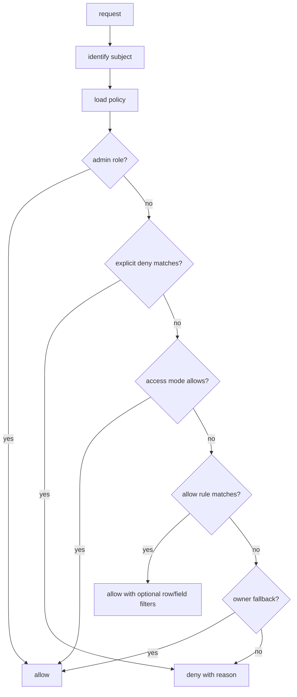
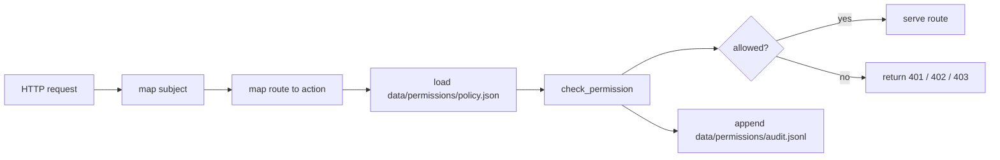

# Permissions Model

DBBASIC permissions are a server-side primitive. Scroll can edit, preview, and
explain rules, but the object server must make the final allow/deny decision.

Many web frameworks treat permissions as something each app has to rediscover:
blog visibility, admin-only pages, intranet roles, or social-app follows. Those
cases matter, but they are not enough for a general business platform.

DBBASIC needs object-level permissions that can model SaaS, customer portals,
employee roles, contractors, paid content, shared workspaces, internal admin
tools, and AI-generated app surfaces with the same small set of primitives.
Getting this right means most apps need less custom permission code.

The model needs to cover the common app cases without forcing every object into
one framework shape:

- public visitors
- signed-in users
- paid subscribers
- temporary paid access
- admins and employees
- customer accounts with their own employees
- object owners
- users or accounts an owner shared with
- per-row and per-field restrictions

## Decision Shape

The core API is:

```python
check_permission(subject, action, policy, collection=None, object_id=None, record=None)
```

It returns:

```python
PermissionDecision(
    allowed=True/False,
    reason="...",
    code="allowed|authentication_required|payment_required|forbidden",
    http_status=200|401|402|403,
    row_filter={...},
)
```

When a list/query request has a row filter but no specific record, the decision
can return `allowed=True` with the row filter attached. The caller then applies
that filter before returning rows.



## Persistence And API

The current public server stores the active policy as:

```text
data/permissions/policy.json
```

If the file does not exist, the server uses a conservative default:

```json
{
  "access_mode": "role_based",
  "roles": {},
  "user_roles": {},
  "rules": [],
  "admin_roles": ["admin", "superuser"]
}
```

That default has no allow grants, so enforcement readiness will block until a
real policy is written. `object_permission_store.starter_policy_payload()`
returns the documented starter policy for a fresh deployment: anonymous
visitors can execute the public pages (`site_home`, `system_dashboard`,
`system_write_probe`) and read the `dbbasic_probe` demo records; signed-in
users can read and execute objects and write probe records; admin-role
subjects bypass rules. Install it with the policy endpoint:

```bash
python3 -c "import json, object_permission_store as s; print(json.dumps({'policy': s.starter_policy_payload()}))" \
  | curl -s -X PUT https://your-host/permissions/policy \
      -H "Authorization: Token <admin-token>" \
      -H "Content-Type: application/json" --data-binary @-
```

Then edit grants per app instead of widening the starter rules in place. Run
audit mode before enforcement to see what live traffic would be denied.

The policy endpoints are still admin-gated while broader login, account
management, and permission editing mature:

```http
GET /permissions/policy
Authorization: Token <token>
```

```http
PUT /permissions/policy
Authorization: Token <token>
Content-Type: application/json
```

```json
{
  "policy": {
    "access_mode": "role_based",
    "roles": {"sales": {"label": "Sales"}},
    "user_roles": {"7": ["sales"]},
    "rules": []
  }
}
```

Identity subjects can come from trusted headers, the admin token, or DBBASIC
session tokens. The session tokens are backed by a small local registry:

```text
data/identity/accounts.tsv
data/identity/users.tsv
data/identity/sessions.tsv
```

Accounts carry tenant/subscription defaults. Users carry account membership,
roles, and user-level subscriptions. A session minted for a registered user can
inherit that account, role, and subscription data, giving permission checks the
same subject shape whether the request came from Scroll, a gateway, or a future
DBBASIC login object.

New DBBASIC-created accounts, users, sessions, shared links, record IDs, and
change/audit IDs should use UUIDv4 values. Imported systems can keep their old
integer or slug IDs as compatibility columns, but new routes and generated UI
should not depend on sequential IDs. This keeps SaaS-style tenant data,
temporary links, subscriptions, shared records, and future package exports from
being tied to one database sequence. The identity registry still accepts string
IDs so Django/PostgreSQL data and older Scroll prototypes can migrate without a
flag day.

Scroll and tests can preview decisions without persisting draft rules:

```http
POST /permissions/check
Authorization: Token <token>
Content-Type: application/json
```

```json
{
  "policy": {
    "access_mode": "role_based",
    "rules": [
      {
        "effect": "allow",
        "principal": "role:sales",
        "actions": ["read"],
        "collection": "contacts",
        "row_filter": {"owner_id": "$user_id"}
      }
    ]
  },
  "subject": {"user_id": "7", "roles": ["sales"]},
  "action": "read",
  "collection": "contacts"
}
```

If `policy` is omitted, `/permissions/check` uses the persisted policy file.
The optional `now` field accepts an ISO timestamp for testing temporary access
windows.

## Route Enforcement

The public server can enforce the persisted policy against object routes and
collection-record routes, but it is intentionally opt-in while auth and Scroll
editing mature.

```text
DBBASIC_ENABLE_PERMISSION_ENFORCEMENT=true
```

That flag requests enforcement. The server only makes it effective when the
readiness checks from `/permissions/status` pass. If recovery, identity, or
policy readiness is incomplete, the request stays in audit/shadow mode and
responses continue to follow the pre-enforcement route behavior. Current
blockers include:

- no admin recovery token
- unreadable identity store
- invalid permission policy
- `password` mode before a password verifier exists
- `role_based` mode with no allow grants
- private, registered, subscription, or role-based modes with no non-admin
  identity path

Operators can see this through:

```json
{
  "permissions": {
    "enforcement_requested": true,
    "enforcement_enabled": false,
    "enforcement_blocked": true
  }
}
```

The explicit recovery/test override is:

```text
DBBASIC_ALLOW_UNREADY_PERMISSION_ENFORCEMENT=true
```

Do not use that override as a normal production setting.

When enforcement is effective, protected routes call the same decision engine
before serving or executing data:



Route actions currently map like this:

- `GET /objects/{id}` -> `execute`
- `POST /objects/{id}` -> `execute`
- `PUT /objects/{id}` -> `update`
- `DELETE /objects/{id}` -> `delete`
- `?source=true` -> `source`
- `?state=true` -> `state`
- `?logs=true` -> `logs`
- `?versions=true` or `?version=N` -> `versions`
- `?metadata=true` -> `read`
- `GET /collections/{collection}/records` -> `read`
- `POST /collections/{collection}/records` -> `create`
- `GET /collections/{collection}/records/{record_id}` -> `read`
- `PUT /collections/{collection}/records/{record_id}` -> `update`
- `DELETE /collections/{collection}/records/{record_id}` -> `delete`

Collection record lists apply row filters before pagination. Record detail
checks include the selected record, so owner, account, subscription, temporary
access, row-filter, and field-redaction rules can all be enforced by the server.
Record writes check the affected record. Updates also check the candidate row
after applying the submitted changes, so a user cannot pass a row filter on the
old row and then move the row into another owner/account by changing fields.

By default the collection record routes are admin-token gated. Read routes can
use audit or enforcement mode with the active policy. Write routes require the
admin token unless permission enforcement is enabled and the active policy
allows the matching `create`, `update`, or `delete` action. Audit-only mode logs
write decisions, but it does not authorize mutations by itself.

Audit-only mode logs decisions without blocking the request:

```text
DBBASIC_ENABLE_PERMISSION_AUDIT=true
```

That is useful before turning enforcement on for a live app. Enforcement also
writes audit entries.

Operators and Scroll can read recent audit entries through the admin-gated audit
endpoint:

```http
GET /permissions/audit?limit=100&object_id=site_home
Authorization: Token <token>
```

Supported filters are `action`, `object_id`, `collection`, `allowed`, and
`enforced`.

By default, route checks only trust the admin token and anonymous public traffic.
If a reverse proxy or auth gateway has already authenticated the request, trusted
identity headers can be enabled explicitly:

```text
DBBASIC_PERMISSION_TRUST_HEADERS=true
```

Supported headers:

- `X-DBBASIC-User-Id`
- `X-DBBASIC-Account-Id`
- `X-DBBASIC-Roles`
- `X-DBBASIC-Subscriptions`

Only enable trusted headers behind infrastructure that strips or overwrites
client-supplied copies.

The server can also mint DBBASIC identity sessions:

```http
POST /identity/sessions
Authorization: Token <admin-token>
```

The admin route can mint arbitrary operator-controlled sessions. For a login
gateway or local trusted client, `POST /identity/session` can mint a session for
an existing active user when `DBBASIC_ENABLE_SESSION_LOGIN=true` and the caller
presents `DBBASIC_SESSION_LOGIN_TOKEN`. That token is separate from the admin
token. The route accepts only `user_id`, `label`, and `ttl_seconds`; role,
account, and subscription overrides are rejected so the subject comes from the
registered user and account.

Sessions store only a token hash under `data/identity/sessions.tsv`. Requests
can then send `Authorization: Token <session-token>` or
`Authorization: Bearer <session-token>`, and the server resolves the subject
directly from its local identity store. This is the first built-in replacement
for each app hand-rolling the same "current user, current account, current
roles, current subscription" lookup.

Clients can inspect or revoke their own active session without the admin token:

```http
GET /identity/session
DELETE /identity/session
Authorization: Token <session-token>
```

Those routes require an active session token and do not treat the admin token as
a user session.

The active subject can be inspected through:

```http
GET /identity
Authorization: Token <token>
```

Admin-token-gated operator routes still require `DBBASIC_ADMIN_TOKEN` by
default. A deployment can opt in to `DBBASIC_ENABLE_SESSION_ADMIN_GATES=true`;
when enabled, an active DBBASIC session whose subject has one of the policy
admin roles can pass the same gate. This is intended for Scroll/operator clients
that should stop carrying the raw deployment token after login exists.

That endpoint returns the normalized `user_id`, `account_id`, roles,
subscriptions, auth method, and permission-mode flags the server will use for
route checks.

Operators and Scroll can inspect permission rollout readiness through:

```http
GET /permissions/status
Authorization: Token <admin-token>
```

That endpoint summarizes the active mode flags, identity counts, persisted
policy shape, covered route groups, blockers, and warnings. It is meant to be
used before enabling enforcement on a live app. For identity-gated modes, one of
these non-admin identity paths must exist before enforcement becomes effective:
trusted proxy headers, guarded session login for existing users, or an active
DBBASIC session.

## Access Modes

Access modes answer who gets through the front door.

- `public` - anyone can read or execute public objects.
- `password` - a shared gate authenticates before policy checks.
- `registered` - any signed-in user can read or execute.
- `subscription` - signed-in users with an active subscription can read or
  execute.
- `role_based` - rules decide by role, user, account, owner, row, field, and
  action.
- `private` - owner-only fallback unless explicit rules grant access.

## Rules

Rules answer what the subject can do once they are known.

Actions should stay small and explicit:

- `create`
- `read`
- `update`
- `delete`
- `execute`
- `source`
- `state`
- `logs`
- `files`
- `versions`
- `share`
- `admin`

Principal strings are portable on purpose:

- `public`
- `registered`
- `owner`
- `role:admin`
- `role:sales`
- `user:42`
- `account:customer-acme`
- `subscription:pro`

Explicit denies are checked before allow rules.

## Ownership

The old object convention still matters:

```text
u_42_report
```

That object belongs to user `42`. Owners can read, execute, update, inspect,
share, and delete their own user objects unless a future stricter policy blocks
that behavior.

Records can also carry ownership fields:

```json
{
  "owner_id": "42",
  "customer_account_id": "customer-acme"
}
```

The server can use `owner_id`, `user_id`, or `created_by` as owner fields for the
basic fallback. Application objects can add richer policy around account,
department, project, team, or customer ownership.

## Sharing

Sharing is just a rule:

```python
PermissionRule.allow(
    "user:99",
    ["read", "update"],
    object_id="u_42_shared_report",
    reason="shared by owner",
)
```

Account sharing uses the same shape:

```python
PermissionRule.allow(
    "account:customer-acme",
    ["read"],
    collection="invoices",
    row_filter={"customer_account_id": "$account_id"},
)
```

That covers the common case where a customer has multiple employees and they all
need access to the customer portal, invoices, files, or support tickets.

Project sharing — "records I own OR records in a project shared with me" —
uses grant records plus one filter value. Grants are rows in the plain
`project_access` collection (`project_id`, `user_id`), so sharing is data:
browseable, audited, versioned. Before checks run, the server resolves the
subject's grants; rules opt in with `$accessible_projects`, which matches
when the record's field value is any granted project id:

```python
PermissionRule.allow(
    "registered",
    ["read"],
    collection="notes",
    row_filter={"project_id": "$accessible_projects"},
    reason="notes in shared projects are readable",
)
```

Pair it with an owner rule on the same collection: matching stays
first-rule-wins at the collection level, but list, single-record, and
search reads evaluate rules per record, so "own" and "shared" rules
combine naturally. The engine itself stays pure — grant resolution is IO
the server does once per request, and the subject carries the result.

Granting is self-serve through the companion value `$owned_projects`,
which resolves to the projects whose `owner_id` is the subject. "Only a
project's owner may share it" — a cross-record condition — becomes a
plain row filter on the grant collection itself:

```python
PermissionRule.allow(
    "registered",
    ["create", "read", "delete"],
    collection="project_access",
    row_filter={"project_id": "$owned_projects"},
    reason="project owners share and revoke access to their own projects",
)
```

Creating a grant is creating a record; revoking is deleting it; both are
audited and appear in the change history like every other write.

## Row And Field Rules

Row filters model rules like:

```text
sales reps only see their own leads
```

As data:

```python
PermissionRule.allow(
    "role:sales",
    ["read"],
    collection="contacts",
    row_filter={"owner_id": "$user_id"},
)
```

Field rules model cases like hiding salary, internal notes, cost, or private
metadata:

```python
PermissionRule.allow(
    "account:customer-acme",
    ["read"],
    collection="invoices",
    fields=["invoice_id", "status", "total"],
    denied_fields=["internal_notes"],
)
```

Schema field permissions add the generated-form version of the same idea. They
live next to field metadata so Scroll can render the right controls and the
server can enforce the same decision:

```json
{
  "name": "margin",
  "type": "currency",
  "permissions": {
    "admin": "edit",
    "sales": "hidden",
    "viewer": "hidden"
  }
}
```

The access levels are:

- `edit` - visible and writable
- `read` - visible but not writable
- `hidden` - removed from reads and not writable

Principal keys can be role names such as `sales`, or full principals such as
`role:sales`, `user:42`, `account:customer-acme`, `subscription:pro`,
`registered`, `public`, or `owner`. Grouped access lists are also accepted:

```json
{
  "name": "notes",
  "permissions": {
    "edit": ["owner", "role:admin"],
    "read": ["role:support"],
    "default": "hidden"
  }
}
```

When multiple principals match one subject, the most restrictive field access
wins. Schema field permissions only refine fields after the broader policy has
already allowed access to the row.

## Subscription And Temporary Access

Subscriptions can be broad:

```python
PermissionPolicy(access_mode="subscription")
```

Or plan-specific:

```python
PermissionRule.allow(
    "subscription:pro",
    ["read"],
    collection="premium_reports",
)
```

Temporary pay-per-view style access is a time-boxed grant:

```python
PermissionRule.allow(
    "user:42",
    ["read"],
    object_id="reports_market_snapshot",
    valid_from="2026-06-01T00:00:00Z",
    expires_at="2026-07-01T00:00:00Z",
)
```

If access should be consumed after one or more views, that should be tracked by
an entitlement or ledger object. The permission rule says access is possible;
the ledger object records purchases, consumption, refunds, and audit history.

For HTTP APIs, missing or expired paid entitlement should map to:

```text
402 Payment Required
```

That is different from:

- `401 Unauthorized` - the server does not know who the user is yet.
- `403 Forbidden` - the server knows the user, but the user is not allowed.
- `402 Payment Required` - the user may be allowed after subscription,
  purchase, credit, or another payment entitlement.

## Scroll Contract

Scroll should eventually call a server endpoint that exposes the same decision
shape:

```json
{
  "allowed": true,
  "reason": "sales reps only see own contacts",
  "code": "allowed",
  "http_status": 200,
  "row_filter": {"owner_id": "$user_id"},
  "fields": null,
  "denied_fields": []
}
```

That lets Scroll show permission previews, generated matrices, "test as role",
and AI-generated rules without becoming the authority.
