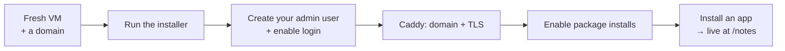

# Quickstart — From a Fresh VM to Your First App

This is the linear path: a bare Debian/Ubuntu VM to a running object
server, a login, a public domain, and a first app installed — in one
sitting, about thirty minutes, most of it waiting on `apt`. Every step
is a real command you can paste.

For the full reference (systemd hardening, journald caps, backups,
permission rollout, per-route proxy allowlists), see
[single-vm deployment](single-vm-deployment.md). This page is the happy
path; that one is the operator's manual.



## 0. What you need

- A small VM (a $5–$7 droplet is plenty) running Debian 12 or Ubuntu
  22.04+, with root or `sudo`.
- Optional but recommended: a domain name with an `A` record pointing at
  the VM's IP, so Caddy can get you automatic HTTPS.

## 1. Run the installer

The installer is a readable script — download it, read it, run it. It
installs dependencies, creates the service user and layout, builds a
virtualenv, generates an admin token, and starts a systemd service on
`127.0.0.1:8001`. It is idempotent, so re-running it is safe.

```bash
git clone https://github.com/askrobots/dbbasic-object-server.git
cd dbbasic-object-server
less scripts/install.sh        # read it first
sudo bash scripts/install.sh
```

When it finishes you have a running server. Confirm:

```bash
curl http://127.0.0.1:8001/health
```

Your admin token lives in `/etc/dbbasic-object-server.env` as
`DBBASIC_ADMIN_TOKEN` (readable by root and the service group only).
Everything the installer did on purpose *not* to do — login, a public
domain, app installs — is below, as short deliberate steps.

## 2. Create your admin user and turn on login

```bash
cd /opt/dbbasic-object-server
sudo -u dbbasic DBBASIC_DATA_DIR=/var/lib/dbbasic-object-server/data \
  .venv/bin/python object_identity_cli.py create-superuser \
  --user-id you --email you@example.com
```

It prompts for a password twice (no echo) and stores only a scrypt hash
under the runtime data directory. Now enable password login and restart:

```bash
sudo sed -i 's/^DBBASIC_ENABLE_PASSWORD_LOGIN=false/DBBASIC_ENABLE_PASSWORD_LOGIN=true/' \
  /etc/dbbasic-object-server.env
sudo systemctl restart dbbasic-object-server
```

## 3. Put a domain and HTTPS in front

Keep uvicorn bound to localhost and let Caddy terminate TLS. If a domain
points at the VM, this is all it takes:

```bash
sudo apt install -y caddy
sudo tee /etc/caddy/Caddyfile >/dev/null <<'EOF'
your-domain.com {
    handle / {
        rewrite * /objects/site_home
        reverse_proxy 127.0.0.1:8001
    }
    handle {
        reverse_proxy 127.0.0.1:8001
    }
}
EOF
sudo systemctl reload caddy
```

Caddy fetches a certificate automatically. Visit `https://your-domain.com`
— you should see the home object, and `https://your-domain.com/login`
should accept the user you just created.

> The catch-all `handle` above proxies every path to the server, which
> relies on the permission policy as the gate. For a locked-down public
> staging box that instead exposes only named routes, use the per-route
> allowlist in [single-vm deployment](single-vm-deployment.md#https-proxy).

## 4. Enable app installs and install your first app

Apps are packages that ship in the repo under `packages/`. Turn on
installs, then ask the server to install one. (Installs are gated by the
admin token, so this stays an operator action.)

```bash
sudo sed -i 's/^DBBASIC_ENABLE_PACKAGE_INSTALLS=false/DBBASIC_ENABLE_PACKAGE_INSTALLS=true/' \
  /etc/dbbasic-object-server.env
sudo systemctl restart dbbasic-object-server

TOKEN=$(sudo grep -oP 'DBBASIC_ADMIN_TOKEN=\K.*' /etc/dbbasic-object-server.env)

# Projects is the hub other apps relate to; install it first, then notes.
for app in app-projects app-notes; do
  curl -s -X POST http://127.0.0.1:8001/packages/$app/install \
    -H "Authorization: Token $TOKEN" -H 'Content-Type: application/json' -d '{}'
  echo
done
```

`app-notes` includes a page object. To turn permission enforcement on so
each user sees only their own notes, follow the audit-then-enforce
rollout in [permissions](permissions-model.md#route-enforcement); on a
single-operator box you can leave it open to start.

Visit `https://your-domain.com/notes`, sign in, and you have a working
notes app — quick capture, projects, search, public sharing — that you
never wrote a line of server code for. Browse
[the app suite](app-packages.md) for the rest (tasks, contacts,
articles, calendar, files, the shell) and install the ones you want.

## 5. Optional: the talk-to-everything shell

Install `app-shell`, then store an AI provider key and chat with your
data — see [the shell and AI guide](shell-and-ai.md). Storing a key is
one command in the shell (`/key anthropic sk-...`), and the AI operates
the server with your permissions.

## What to do next

- **Back it up.** All state is files under
  `/var/lib/dbbasic-object-server/data`; see [backup and restore](backup-restore.md).
- **Harden it.** systemd sandboxing, journald caps, and the readiness
  gates are in [single-vm deployment](single-vm-deployment.md).
- **Understand the model.** [Why DBBASIC](why-dbbasic.md) and
  [comparisons](comparisons.md) explain what you are and are not
  signing up for.
- **Build.** Copy `app-notes` to make your own app
  ([package authoring](package-authoring.md)), or add a system-tool
  object ([capability objects](capability-objects.md)).

## Upgrading later

```bash
cd /opt/dbbasic-object-server
sudo -u dbbasic git pull --ff-only
sudo -u dbbasic .venv/bin/python -m pip install -e '.[server]'
sudo systemctl restart dbbasic-object-server
```

Changes to live objects and schemas need no deploy at all — that is the
point. Only server-code upgrades need the pull-and-restart above.
