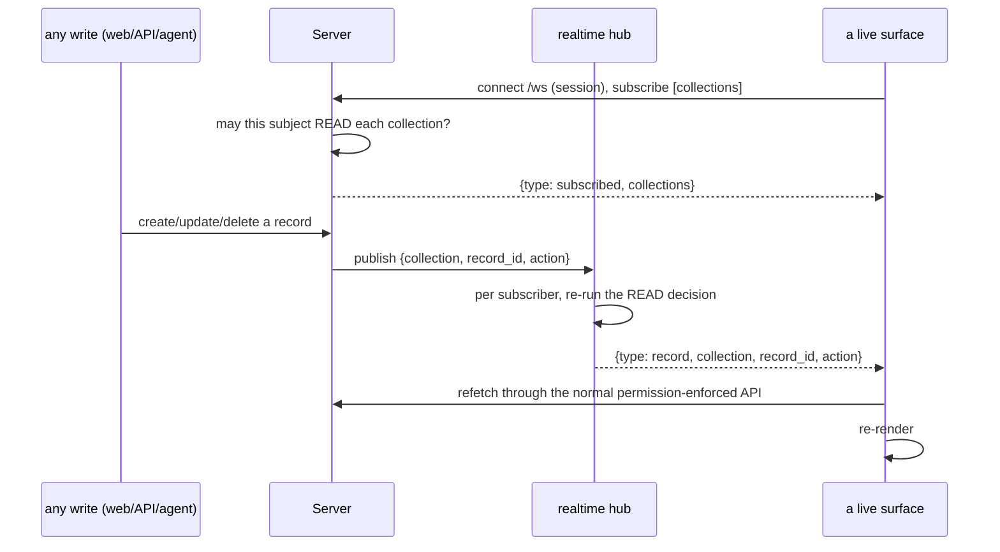

# Realtime — The Change Log and Live Surfaces

Every generative surface — every list, table, board, detail page, comment
thread, and attachment list — subscribes to the change log and re-renders when a
record it can see changes, from any tab, user, or agent. This falls out of one
small websocket contract with a deliberate rule: **the wire carries a signal,
never the record body.**



## Transport

`GET /ws` (upgraded to a websocket). The connection is **authenticated** — a
session cookie or bearer token — and anonymous connections are refused (`1008`).
Realtime is behind a flag; when off, surfaces fall back to polling.

## Client protocol

Messages are JSON. On accept, the server sends `{"type": "welcome", "user": ...}`.
Then:

| Client sends | Server replies |
|--------------|----------------|
| `{"action": "subscribe", "collections": ["tasks", "notes"]}` | `{"type": "subscribed", "collections": [...]}` — only the collections the subject may read are kept |
| `{"action": "unsubscribe", "collections": [...]}` | `{"type": "subscribed", "collections": [...]}` |
| `{"action": "ping"}` | `{"type": "pong"}` |

Subscriptions are capped per connection, and each collection name is validated.

In the browser this is wrapped as one helper, `window.dbbasicSubscribe(collection,
handler)` (served by the `nav` object): it opens the socket once, subscribes on
demand, reconnects with backoff, and runs a ~20-second poll as a fallback for
missed events and multi-worker deployments. A page never talks to `/ws`
directly — it calls `dbbasicSubscribe` and re-renders in the handler.

## The event

A change pushes exactly:

```json
{ "type": "record", "collection": "tasks", "record_id": "…", "action": "update" }
```

`action` is `create` / `update` / `delete`. **No field values travel** — only
which record changed. The client reacts by *refetching* through the ordinary
API, which re-applies the full permission policy and field redaction. So a live
surface can never show a field the API wouldn't have served.

## Permission filtering — twice

Realtime is inside the permission engine, not beside it:

1. **On subscribe** — a subject may follow a collection only if it may `READ`
   it (`_ws_can_subscribe` runs the same check a `GET` would).
2. **On publish** — for each subscriber, the server re-runs the READ decision
   *against the changed record*, so a row-filtered subscriber only hears about
   rows its filter would let it see. If the policy can't be loaded to filter
   safely, nothing is pushed.

Combined with the signal-only payload, this means the change log leaks neither
the existence of records you can't see (filtered per-subscriber) nor their
contents (never sent).

## Why signal, not body

- **Security** — the wire can't leak a field, because it carries none. All
  reads go back through the one enforced path.
- **Simplicity** — there is no second serialization/redaction path to keep in
  sync with the API; the client just refetches.
- **Correctness under races** — the refetch always returns the current row, so a
  burst of edits collapses to one correct re-render rather than replaying stale
  bodies.

The durable, poll-based event log remains the fallback for missed pushes and
for deployments with more than one worker process.

## Related

- [`asgi-realtime-direction.md`](asgi-realtime-direction.md) — why the server
  uses plain ASGI and how websocket/SSE object events fit the direction.
- [`generative-ui.md`](generative-ui.md) — the surfaces that subscribe.
- [`permissions-model.md`](permissions-model.md) — the READ decision reused on
  subscribe and on every push.
- [`runtime-contract.md`](runtime-contract.md) — the daemon and event contracts
  behind the durable log.
