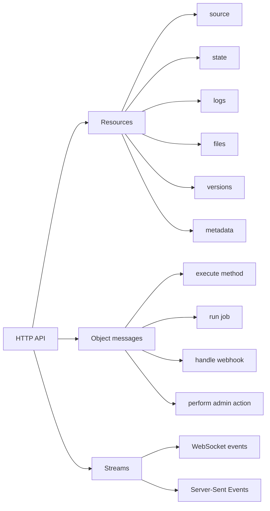

# REST And Object Messages

DBBASIC should be RESTful where it exposes resources and direct where it
executes behavior.

The goal is not to pretend every operation is pure REST. The goal is to keep a
clean split:



## Why This Matters

Many APIs called REST are really RPC over HTTP:

```text
POST /doThing
POST /executeAction
POST /api/run
```

That shape is easy to add, but it hides what the system actually owns. DBBASIC
objects own real resources: source, state, logs, files, versions, and metadata.
Those should be exposed as resources with stable paths, predictable HTTP
methods, status codes, and JSON representations.

Object behavior is different. Executing an object is message passing. Jobs,
events, webhooks, and realtime commands are also messages. They should be
documented as messages instead of disguised as fake CRUD resources.

## RESTful Resource Surface

DBBASIC should keep these resource-style endpoints boring and predictable:

```text
GET /objects
POST /objects
GET /objects/{object_id}?source=true
PUT /objects/{object_id}?source=true
GET /objects/{object_id}?state=true
GET /objects/{object_id}?logs=true
GET /objects/{object_id}?versions=true
GET /objects/{object_id}?version=N
DELETE /objects/{object_id}?destroy=true
```

These endpoints expose things the object server owns.

They should preserve:

- stable object identity
- standard HTTP status codes
- JSON response shapes existing clients can keep using
- explicit authorization checks
- useful cache behavior where safe
- compatibility with `docs/http-api-contract.md`

## Object Message Surface

Object execution is not only CRUD. It is behavior:

```text
GET /objects/{object_id}
POST /objects/{object_id}
PUT /objects/{object_id}
DELETE /objects/{object_id}
```

Those calls deliver a method and payload to the object.

That model is closer to:

```text
object_id + method + payload -> result
```

than:

```text
table + row + CRUD operation
```

This is intentional. A DBBASIC object can represent a report, worker, webhook,
view, business process, queue handler, generated UI, or admin tool.

## Rollback

Rollback is the awkward case:

```text
POST /objects/{object_id}
{"action": "rollback", "version_id": 1}
```

That is a message, not a pure REST resource update. It is kept for compatibility
with existing clients.

Future server code may add a cleaner resource-style alias, but it should not
break the existing message shape without a migration:

```text
POST /objects/{object_id}/versions/{version_id}/rollback
```

## Design Rule

Do not turn every operation into `/api/doThing`.

Use resources for object-owned data:

```text
source, state, logs, files, versions, metadata
```

Use messages for object-owned behavior:

```text
execute, run, handle, repair, migrate, broadcast
```

Use streams for object-owned realtime feedback:

```text
source changed, state changed, log appended, version saved, execution failed
```

That is the honest shape of DBBASIC: REST where resources are real, object
messages where behavior is real, and streams where live feedback is real.
