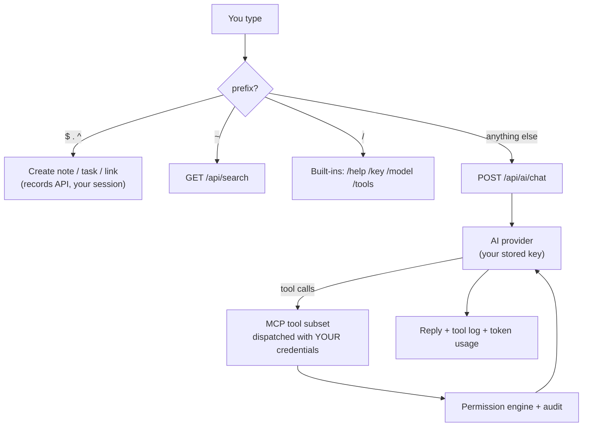

# The Shell and AI — Talk to the Whole System

The shell (`/shell`) is one input that reaches everything: instant
record commands, global search, and an AI that operates the server
through the same MCP tools any agent uses — with **your key, your
model choice, and your permissions**.



## Setup: Your Key, Your Model

AI features use each user's own provider key — the server stores it
write-only and calls providers on your behalf. Key material never
appears in any response, record, or backup.

In the shell:

```
/key anthropic sk-ant-...     store a key (masked, never logged)
/keys                          which services have keys
/model anthropic:claude-haiku-4-5     pick a model (service:model)
/model openai:gpt-5-mini              or another provider
```

Or over HTTP: `PUT /identity/users/{you}/service-keys` with your
session (see the [HTTP API contract](http-api-contract.md)).

## Tool Subsets: Small Context, Configurable Power

The AI is offered a **named subset** of the MCP tool catalog, not the
whole thing. Small subsets keep the context small enough for fast,
inexpensive models — and the subset is your safety dial:

```
/tools global_search,list_records,get_record,create_record     conversation mode
/tools global_search,list_objects,get_object_source,create_object,update_object_source,execute_object     builder mode
```

Every tool call the model makes is dispatched through the server's own
routing **with your credentials**: the AI can do exactly what you could
do yourself — row filters, field redaction, and the audit trail apply.
An AI acting for a user is never more powerful than the user.

## Conversation Memory

The shell logs every exchange to the `shell_commands` collection (your
history is just records — searchable and owner-scoped). A new browser
session replays recent history and sends prior AI turns back with each
message, so conversations resume. The server stays stateless about
chats: `POST /api/ai/chat` accepts a `history` list, and what to
remember is the client's choice.

## Coding Without Coding

With builder-mode tools, the AI can create and edit live objects:

> make an object called site_dice that renders a page rolling two dice

The model writes the source, calls `create_object`, and the page is
live at `/dice` immediately — objects load per execution, so there is
no deploy step between the AI writing code and the code serving
traffic. Edits use `update_object_source`; every version lands in
source history with rollback; and create/update responses report the
methods the code actually exposes, so the model can self-correct.

Object writes ride the admin gate (an admin-role session today), and
source writes require `DBBASIC_ENABLE_SOURCE_WRITES=true` — the same
boundaries that govern humans.

## The Instant Commands

| Input | Effect |
|---|---|
| `$ pay the hosting bill` | quick note |
| `. fix the header` | quick task |
| `^https://example.com docs` | save a link |
| `~flywheel` | global search across collections |
| `/help` | list commands |

These never touch the AI — they are one permission-checked record
write each, which is why they feel instant.

## For Agents

Everything above is equally available to AI agents connecting over MCP
(`POST /api/mcp`) with their own identities and labeled sessions, and
to headless callers hitting `POST /api/ai/chat` directly. One surface,
many kinds of operator.
