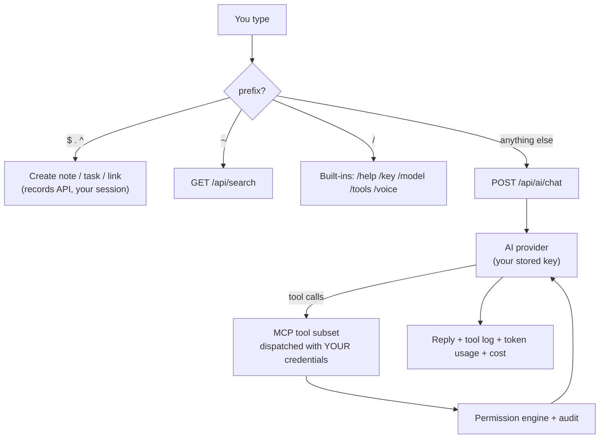

# The Shell and AI — Talk to the Whole System

The shell (`/shell`) is one input that reaches everything: instant
record commands, global search, and an AI that operates the server
through the same MCP tools any agent uses — with **your key, your
model choice, and your permissions**.


```mermaid
flowchart TD
    U["You type"] --> D{"prefix?"}
    D -->|"$ . ^"| REC["Create note / task / link<br/>(records API, your session)"]
    D -->|"~"| SRCH["GET /api/search"]
    D -->|"/"| CMD["Built-ins: /help /key /model /tools /voice"]
    D -->|"anything else"| CHAT["POST /api/ai/chat"]
    CHAT --> PROV["AI provider<br/>(your stored key)"]
    PROV -->|"tool calls"| MCP["MCP tool subset<br/>dispatched with YOUR credentials"]
    MCP --> PERM["Permission engine + audit"]
    PERM --> PROV
    PROV --> REPLY["Reply + tool log + token usage + cost"]
```

## Setup: Your Key, Your Model

AI features use each user's own provider key — the server stores it
write-only and calls providers on your behalf. Key material never
appears in any response, record, or backup. Two providers are supported
today (`object_ai.SUPPORTED_SERVICES`): `anthropic` and `openai` — no
Gemini, no local/on-device inference. An `openai` key, once stored, also
covers the cloud voice paths above (`POST /api/tts` with `engine: "openai"`,
`POST /api/stt`) — one key, no separate signup for voice.

In the shell:

```
/key anthropic sk-ant-...     store a key (masked, never logged)
/keys                          which services have keys
/model anthropic:claude-haiku-4-5     pick a model (service:model)
/model openai:gpt-5-mini              or the other provider
```

Or over HTTP: `PUT /identity/users/{you}/service-keys` with your
session (see the [HTTP API contract](http-api-contract.md)).

## Tool Subsets: Small Context, Configurable Power

The AI is offered a **named subset** of the MCP tool catalog, not the
whole thing. Small subsets keep the context small enough for fast,
inexpensive models — and the subset is your safety dial:

```
/tools global_search,list_records,get_record,create_record     conversation mode
/tools global_search,list_objects,get_object_source,create_object,update_object_source,execute_object     builder mode
```

Every tool call the model makes is dispatched through the server's own
routing **with your credentials**: the AI can do exactly what you could
do yourself — row filters, field redaction, and the audit trail apply.
An AI acting for a user is never more powerful than the user.

## Conversation Memory

The shell logs every exchange to the `shell_commands` collection (your
history is just records — searchable and owner-scoped). A new browser
session replays recent history and sends prior AI turns back with each
message, so conversations resume. The server stays stateless about
chats: `POST /api/ai/chat` accepts a `history` list, and what to
remember is the client's choice.

## Cost Recording

Every chat turn is priced server-side, not by the caller. `POST
/api/ai/chat` reads token counts straight from the provider's own response,
looks up the model's price in the `ai_prices` collection (editable records,
never a hardcoded table -- so a price change is a data edit, not a
deploy), and computes the cost in integer cents: `tokens *
per_million_cents // 1_000_000`, input and output added separately, no
float division on money. The result -- `tokens_in`, `tokens_out`,
`cost_cents`, `model`, `provider` -- lands in the `ai_usage` collection,
written by the chat handler itself with the caller's user id as actor, so
the record can't be skipped or forged the way a client-written log could
be. A model with no matching price row still gets its tokens recorded;
only the cost is null. The same numbers come back in the chat response's
`usage` object so a surface can show them immediately.

## Coding Without Coding

With builder-mode tools, the AI can create and edit live objects:

> make an object called site_dice that renders a page rolling two dice

The model writes the source, calls `create_object`, and the page is
live at `/dice` immediately — objects load per execution, so there is
no deploy step between the AI writing code and the code serving
traffic. Edits use `update_object_source`; every version lands in
source history with rollback; and create/update responses report the
methods the code actually exposes, so the model can self-correct.

Object writes ride the admin gate (an admin-role session today), and
source writes require `DBBASIC_ENABLE_SOURCE_WRITES=true` — the same
boundaries that govern humans.

## Voice

The shell doubles as a push-to-talk terminal. Speech in and speech out each
have two paths: browser-native (free, on-device, always available if the
browser supports it) and cloud (a real per-user OpenAI key, real cost, but
"not on device" — works on browsers/hardware the native APIs don't cover,
and sounds noticeably better than the local synthesis engines).

- **Speech in, browser path**: the mic button uses `window.SpeechRecognition`
  (or the `webkit` prefix); interim words show live in the input, and the
  final transcript submits through the same form-submit path a typed line
  does — no separate send code. Neither Chrome nor Safari expose the API
  outside a secure context (`https://` or `localhost`), and without it the
  button simply stays hidden. This is the default (`talk_stt_engine: "browser"`).
- **Speech in, cloud path**: when `talk_stt_engine` is `"openai"`, the mic
  becomes push-to-talk instead of continuous listening — tap to start a
  real `MediaRecorder` capture, tap again to stop and upload the clip to
  `POST /api/stt`, which transcribes it via the caller's own stored OpenAI
  key and returns text. No wake word, no VAD silence endpoint: raw audio has
  no equivalent to `SpeechRecognition`'s live partial-result signal, so
  there is no live signal to drive one. See `POST /api/stt` below.
- **Speech out, browser path**: `speechSynthesis.speak` — free, on-device,
  no server round-trip.
- **Speech out, cloud path**: when `talk_tts_engine` is `"openai"`, assistant
  replies (markdown and code fences stripped first — only prose is spoken,
  never tool-call noise) POST to `POST /api/tts` with `"engine": "openai"`
  and play the returned `audio/mpeg`, via the caller's own stored OpenAI key.
  If the request fails for any reason, the browser's own `speechSynthesis`
  says the line instead, so voice mode never goes silent because of a
  server-side gap.

`/voice`, `/voice on`, `/voice off` toggle voice mode inline (mirrors
`/model`); the setting persists on `shell_preferences.voice_enabled` and is
honored on page load like `ai_model` and `tools`. `talk_tts_engine` and
`talk_stt_engine` (both default to the free/local path) live on the same
`shell_preferences` record — the Talk page (`/talk`) additionally has a
single in-page toggle that flips both together, since "cloud voice" is one
combined mode to remember, not two settings.

### `POST /api/tts`

```http
POST /api/tts
Authorization: Bearer <session-token>   (or the session cookie)

{"text": "one note matches", "voice": "en-us", "engine": "local"}
```

Response: audio bytes (`audio/wav` for `engine: "local"`, `audio/mpeg` for
`engine: "openai"`), or the usual `{"status": "error", "error"}` JSON shape
on failure. Requires `DBBASIC_ENABLE_TTS=true` (off by default) and a
signed-in session — same posture as `/api/ai/chat`. `text` is capped at 800
characters (413 beyond that). `engine` is optional, `"local"` or `"openai"`,
defaulting to `"local"` — the two paths never silently fall back to each
other; a caller who asked for cloud quality and hits a provider error sees
that error.

**`engine: "local"`** (default): discovered at call time, first match wins:
`espeak-ng`, `espeak`, then macOS `say` (development convenience — `say`
writes AIFF and the also-stock `afconvert` turns it into WAV; if `afconvert`
isn't present the endpoint returns 501 rather than growing a bespoke audio
pipeline). No engine on `PATH` at all is a 503 with a clear message.

**`engine: "openai"`**: calls OpenAI's TTS API (`gpt-4o-mini-tts` by
default) using the caller's own key, stored via `PUT
/identity/users/{user_id}/service-keys` (`service: "openai"`) — no key
stored is a 400 with the exact PUT to fix it. A provider-side failure (bad
key, rate limit) is a 502. `DBBASIC_TTS_CLOUD_TIMEOUT_SECONDS` bounds the
outbound call (default 30s).

Successful audio is cached at
`data/tts-cache/{sha256(engine|voice|text[|model])}.wav` regardless of
engine — a repeat of the same line is a cache read, not a re-synthesis.
There's no eviction in v1; operators who want a bound should prune that
directory on their own schedule.

### `POST /api/stt`

```http
POST /api/stt
Authorization: Bearer <session-token>   (or the session cookie)
Content-Type: audio/webm

<raw audio bytes>
```

Response: `{"status": "ok", "text": "..."}`, or the usual
`{"status": "error", "error"}` shape. The request body is the raw audio
bytes themselves (whatever `MediaRecorder` produced client-side — typically
`audio/webm` on Chrome/Firefox, `audio/mp4`-ish on Safari), not JSON; the
`Content-Type` header says what format it is. Requires
`DBBASIC_ENABLE_STT=true` (off by default, unlike TTS which many operators
turn on immediately — STT costs money on every utterance, not just the
occasional reply) and a signed-in session. Capped at 10MB per clip (413
beyond that).

Unlike TTS, there is **no local-engine path here at all** — every call goes
to OpenAI's transcription API (`gpt-4o-mini-transcribe` by default), using
the caller's own stored key exactly like the TTS cloud path. No key stored
is a 400; a provider-side failure is a 502.
`DBBASIC_STT_TIMEOUT_SECONDS` bounds the outbound call (default 30s).
Nothing is persisted server-side beyond the ordinary `ai_usage`/cost
accounting every provider call gets — the audio itself is uploaded,
transcribed, and discarded within the request.

## Reading the Web

The AI can fetch and read a real web page — the lynx/w3m move for an AI +
voice consumer: strip a URL down to `{title, text, links}`, links numbered
in document order so they double as speakable navigation targets ("open
link three"). It is a real, tested loop: read a page, get a short spoken
summary with numbered links, say "open link one," and it resolves against
the previous turn's link list, fetches that page, and summarizes it too —
follow a chain of pages by voice alone.

The `read_page` tool is offered like any other MCP tool (add it to a
`/tools` subset to use it) and calls `object_reader.py` server-side, gated
behind `DBBASIC_ENABLE_READER` (off by default). Fetching is SSRF-hardened:
every hostname — the original and every redirect hop — is resolved and
checked before the socket opens, refusing loopback/link-local/private
ranges and failing closed on any resolution ambiguity; `http`/`https` only,
a small redirect cap, and hard timeout/size limits. HTML is stripped with
`html.parser` (no regex scraping), never a headless browser — JS-rendered
pages, images, and login-walled pages are out of scope by design.

A fetched page can also be shown on screen as a `{"kind": "reader", "url":
...}` view block (title + body text + the numbered link list), fetched
client-side through `POST /api/read` — the same flag and SSRF posture
apply.

## The Instant Commands

| Input | Effect |
|---|---|
| `$ pay the hosting bill` | quick note |
| `. fix the header` | quick task |
| `^https://example.com docs` | save a link |
| `~flywheel` | global search across collections |
| `/help` | list commands |

These never touch the AI — they are one permission-checked record
write each, which is why they feel instant.

## For Agents

Everything above is equally available to AI agents connecting over MCP
(`POST /api/mcp`) with their own identities and labeled sessions, and
to headless callers hitting `POST /api/ai/chat` directly. One surface,
many kinds of operator.
