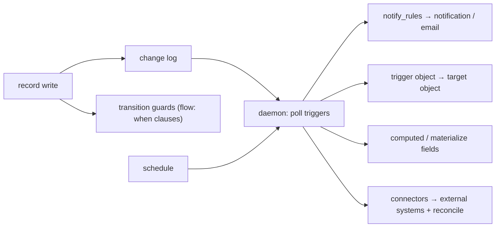

# Validation and Business Logic

Two things a schema-driven system has to get right without per-app code:
rejecting bad writes, and running the business rules a record's lifecycle
implies. DBBASIC does both from the schema, enforced on the server — the form
is a convenience, not the gate.

## Validation — declared once, enforced on every write

The write path (create and update) validates each field against the schema,
server-side, regardless of which surface issued the write (web form, API, MCP
agent, AI). A form's client-side checks are a nicety on top; they are not what
protects the data.

What is enforced today:

| Check | Declared as | Enforced |
|-------|-------------|----------|
| Type parses | `type` (integer, number, date, datetime, boolean, enum) | ✅ |
| Required present | `required: true` | ✅ |
| Enum membership | `enum: [...]` | ✅ (value must be in the list) |
| Length bounds | `validation.min_length` / `max_length` | ✅ |
| Pattern | `validation.pattern` (regex) | ✅ |
| Referential integrity | `relation: {collection}` | ✅ (id must exist in the target) |
| State transition | field `transitions` map / `flow` | ✅ (status can only move where allowed) |
| Read-only / computed | `read_only` / `type: computed` | ✅ (client value rejected) |
| Storable in TSV | (substrate) | ✅ (size, no NUL/control chars) |

Referential integrity and enforced state transitions are the notable ones —
most no-code tools skip both. A relation is a *validated pointer*: you cannot
point a `project_id` at a project that doesn't exist. A status field with a
`transitions` map is a state machine: an order can go `open → cancelled` only
if the schema says so.

### Known gaps

- **Numeric range** — we bound string length, not numeric value (a price can go
  negative). A `min`/`max` value rule is the fix.
- **Uniqueness** — no unique constraint (e.g. unique email).
- **Declarative cross-field rules** — no formula language yet for
  "end_date > start_date" (`visible_when` handles conditional *visibility*,
  not validation). The general mechanism exists, though: a **pre-write hook**
  (below) expresses any cross-field or cross-collection rule in real code. A
  Salesforce-style declarative rule (formula + message) remains the ergonomic
  follow-on for the common cases.
- **Inline client feedback** — the form pre-checks `required`; length/pattern
  errors currently surface after a server round-trip, and messages are
  technical ("longer than max_length"). Friendlier, inline feedback is a
  UX polish item, not a safety gap.

## Pre-write hooks — code inside the write path

For rules the schema can't express, a collection declares a **hook object**:

```json
{ "name": "fin_journals", "hooks": { "before_write": "hook_fin_journals" } }
```

The object's `BEFORE_WRITE(request)` runs **synchronously inside the generic
HTTP write path** — after permission checks, before persist — for every public
create/update on that collection. `request` carries `{collection, action,
record, existing, changes, subject}`. It returns `None` to allow,
`{"error": "...", "status": 4xx}` to reject with its own message, or
`{"record": {...}}` to transform (the transformed record still passes full
schema validation, and can never touch `id`, `owner_id`, or read-only/computed
fields).

The contract is deliberately strict:

- **Fail closed** — a declared hook that is missing, raises, or returns a
  non-contract shape rejects the write. A gate that silently passes on error
  is not a gate.
- **After permissions** — a denied subject never reaches the hook.
- **Opt-in per collection** — collections without `hooks` pay one cached dict
  lookup; the original latency concern that deferred this feature
  ([`event-hooks-decisions.md`](event-hooks-decisions.md)) stays bounded.
- **Public surface only** — trusted server-side writers (the daemon,
  migrations, seed-merge) call the storage layer directly and bypass hooks.

This is what keeps the generative form working when custom logic arrives: the
form still POSTs to `/collections/{c}/records`; the rule lives server-side.
First adopter: `fin_journals` refuses to post a journal whose lines don't
balance — a cross-collection rule (it sums `fin_journal_lines`) no schema key
could express.

## Business logic — the automation substrate

Business rules run without per-app code through a set of declarative
primitives, driven by a background daemon and the change log:



- **Transitions with guards** — a `flow`/`transitions` map is a conditional
  state machine; a `when` clause gates whether a move is allowed. The board's
  drag and every status write run through it.
- **notify_rules** — declarative "a record changed → send a notification /
  email." Data, not code.
- **Trigger → target objects** — the daemon polls trigger objects and executes
  target objects: the event-handler path (see
  [`runtime-contract.md`](runtime-contract.md) and
  [`event-hooks-decisions.md`](event-hooks-decisions.md)).
- **Computed / materialized fields** — derived values (`type: computed`,
  `materialize_definitions`).
- **Connectors** — external side effects expressed as desired-state records
  with a reconcile pass.
- **Scheduled passes** — the daemon runs periodic work (compaction,
  auto-transitions).

This is the same family as Salesforce flows/validation-rules, Hasura event
triggers, and Directus Flows — declarative automation over a data store, here
on plain-text records.

### Where it's heading

The single highest-leverage addition is **formula / rollup fields** — declare
`total_cents = sum(order_lines.amount_cents)` or `full_name = first + " " +
last` in the schema and have the platform derive it everywhere. It composes
with display, validation, and business logic at once — the reason Airtable and
Salesforce feel like magic. **Declarative validation rules** (cross-field
formula + message) are the natural second, closing the cross-field gap and
adding business logic in the same stroke.

## Related

- [`schema-forms.md`](schema-forms.md) — the field contract these checks read.
- [`runtime-contract.md`](runtime-contract.md) — the daemon, triggers,
  schedules, and event contracts.
- [`event-hooks-decisions.md`](event-hooks-decisions.md) — why event handlers
  are shaped the way they are.
- [`storage-modes.md`](storage-modes.md) — append-only collections, the
  immutable substrate for audit-shaped data (journals, stock moves).
